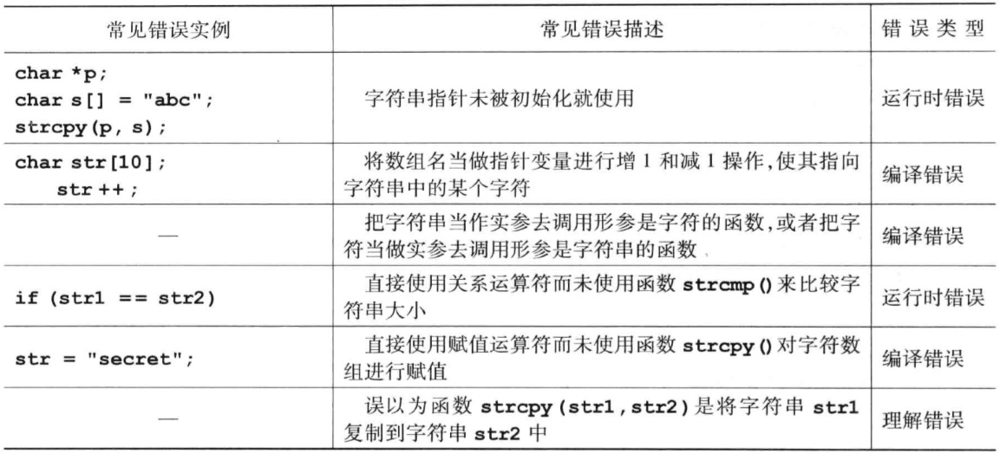

# 字符串

__字符串存储__

一个字符串可以存于字符数组中，但一个字符型数组中存储的并非一定是字符串，这要看它的最后一个元素是否为 `'\0'`。`'\0'` 是字符串的结束标志，占据一个字节的内存，但是不计入字符串长度，只计入数组长度。

所以，使用字符数组保存字符串时，需要人为地在数组的最后添加 `'\0'`，这样才能将其作为字符串来使用。

若字符串太长，可以分成几个片段写在多行：

```c
char longString[] = "this is the first half of the string "
                    "and this is the second half.";
```

__字符指针__

字符指针是 __指向字符型数据__ 的指针变量，每个字符串在内存中都占用一段连续的空间，只要将字符串的首地址赋给字符指针，即可让字符指针指向该字符串。对于字符常量而言，它本身就代表其首地址。

```c
char str[10] = "Hello";
char *ptr = str; 
// 第二句相当于下面两句
char *ptr;
ptr = str;
```

这里让 `ptr` 指向字符数组的首地址，因为首地址是一个地址值常量，所以不能修改 `ptr`，而能够修改 `ptr` 指向的数据，即字符数组的第一个字符。

__访问字符串中单个字符__

可以用两种方式来访问：

- 因为使用字符数组存储，所以可以用下标直接访问；
- 通过 __字符指针__ 间接访问，如 `*(ptr + i)`。

__字符串的输入输出__

1.用 `'\0'` 为结束标志遍历输出：
```c
for(i = 0; str[i] != '\0'; i++) 
    printf("%c\n", str[i]);
```

2.以 `%s` 格式修饰符整体输入输出：

```c
printf("%s\n", str);
scanf("%s", str); // str 本身就是一个地址，无需加 &
// 读入一个字符串，知道遇到空白符号为止
```

3.`gets()` 和 `puts()`

使用 `gets()` 字符串处理函数，__可以输入带空格的字符串。__`gets()` 以回车作为字符串的终止符，同时将回车从缓冲区读走，不作为字符串的一部分，而 `scanf` 仍将回车留在缓冲区中。

`puts()` 用于从参数给出的地址开始，依次输出存储单元中的字符，当遇到第一个 `'\0'` 的时候结束，并自动输出一个换行符。

```c
char name[N];
gets(name);
printf("%s\n", name);
```

> #### Danger::缓冲区溢出
> 
> `gets()` 和 `scanf()` 都不能限制输入字符串的长度，容易引起缓冲区溢出。如果不能确保输入字符串长度不超过数组大小，建议使用 `fgets()` 函数：
> ```c
> char name[N];
> fgets(name, sizeof(name),stdin);
> ```
> 表示从标准输入 stdin 中读取一行长度为 `sizeof(name)` 的字符串到首地址为 `name` 的存储区中。

__字符串处理函数__

在 `string.h` 中定义了字符串处理函数：

| 函数调用形式 | 功能描述和说明 |
| ----------- | --------------------------|
| `strlen(str)` | 返回字符串 __实际长度__ |
| `strcpy(str1, str2)` | 将 `str2` 复制到 `str1`，要确保 `str1` 的大小足够放下。 |
| `strcmp(str1, str2)` | 比较方法：从左至右按 __ASCII 码值__ 逐一比较，直到出现不同字符。<br />结果分三种情况：<br /> - `str1>str2`，返回值 __> 0__<br /> - `str1==str2`，返回值 __==0__<br /> - 否则返回值小于0. |
| `strcat(str1, str2)` | 将第二个字符串接到第一个字符串的末尾，返回第一个字符串的首地址。 |

> #### Warning::
> 
> - 对字符串赋值不能使用赋值运算符，只能使用 `strcpy()`；
> - 对字符串的比较不同于对单个字符的比较，不能直接用关系运算符，只能使用 `strcmp()`。

__向函数传入字符串__

可以使用字符数组，也可以使用字符指针。

使用字符数组：
```c
void MyStrcpy(char dstStr[], char srcStr[]) {
    int i = 0;
    while(srcStr[i] != '\0') {
        dstStr[i] = srcStr[i];
        i++;
    }
    dstStr[i] = '\0';
}
```

使用字符指针：

```c
void MyStrcpy(char *dstStr, *srcStr) {
    while(*srcStr != '\0') {
        *dstStr = *srcStr;
        srcStr++;
        dstStr++;
    }
    *dstStr = '\0';
}
```

__函数返回指向字符串指针__

函数定义只是比普通函数多了一个星号 `*`：`char *f();`，这和函数指针 `char (*f)()` 不同：

```c
char *MyStrcat(char *dstStr, char *srcStr) {
    char *pStr = dstStr; // 保存首地址
    while(*dstStr != '\0') dstStr++; // 指针移到 dstStr 末尾
    while(*srcStr != '\0') {
        *dstStr = *srcStr;
        dstStr++;
        srcStr++;
    }
    *dstStr = '\0';
    return pStr;
}
```

__常见错误__


