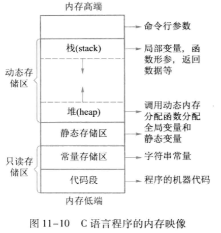

# 指针和数组的关系

## 指针和一维数组的关系

__数组名的特殊意义__
数组名表示存储数组元素的连续存储空间的首地址，即指向数组中第一个元素的常量指针。所以，数组元素既可以用下标法也可以用指针法来引用，例如下面两种调用是等价的：
- `a[i]`
- `*(a+i)`

__指针运算的特殊性__
`p++` 并非将指针变量的值简单加一，而是加上了 `sizeof(类型)` 个字节。


__数组和指针在作为函数参数进行按地址调用中的相似性__
用数组名和用指向一维数组的指针变量作函数实参，传递的都是 __数组的起始地址__，都是 __按地址调用__。对一维数组而言，用数组或指针变量作形参是一样的——都是起始地址，都需要据此进行间接寻址，所以可以以下标形式，也能以指针形式来访问元素。


## 指针和二维数组的关系


可以将二维数组 `a` 看成是 `a[0],a[1],a[2]` 三个元素组成的一维数组。`a+1` 表示 __首地址所指元素后面的那个元素的地址__，即 `&a[1]`，通过这些地址就可以引用各个元素的值，例如 `*(a+2)` 为元素 `a[2]`。但是需要注意，这里 __所谓的元素仍然是一个地址__。


`a[2]` 表示的是一个一维数组的首地址（`&a[2][0]`），`a[2]+1` 表示 `&a[2][1]`，所以 __`*(a[2]+1)` 就是元素 `a[2][1]`__。

> #### Warning::`a[0]+1` 和 `a+1` 的区别
> 
> - 由于 `a[0]` 可以看成是由 4 个整型元素组成的一维数组的数组名，因此 `a[0]+1` 中的 `1` 代表的是 __一个整型元素所占字节数__，也就是二维数组中一列所占字节数；
> - 而 `a` 可以看成是二维数组的数组名，所以 `a+1` 中的 `1` 表示 __一个一维数组(含有 4 个整型元素)所占字节数__，也就是二维数组中一行所占字节数。

在上面的二维数组中：
- `a[i]` 可以看成是由四个元素(a[i][0] - a[i][3])组成的 __一维数组的数组名__，也代表这个 __一维数组第一个元素的地址(`&a[i][0]`)__。
- `a[i] + j` 也可写作 `*(a+i) + j`，代表 __这个一维数组中下标为 j 的元素的地址(`&a[i][j]`)__，所以 `*(a[i]+j)` 即 `*(*(a+i)+j)` 就表示这个地址处的数据 `a[i][j]`。

所以下面四种表示 `a[i][j]` 的写法等价：
- `a[i][j]`
- `*(a[i]+j)`
- `*(*(a+i)+j)`
- `*(a+i)[j]`

__`a+i` 可以看成第 i 行的首地址，每加一表示指向下一行(a+1)；`a[i]` 可以看成第 i 行第 0 列的地址，每加一表示指向下一列(a[i]+1)。__

__通过行指针和列指针来引用二维数组元素__

行指针的定义和初始化：

```c
int (*p)[4];
p = a;
```
这里定义了一个指针变量，__指向一个含有四个元素的一维数组__。然后把二维数组首地址赋给指针，该指针即指向第一行的一维数组。

> #### Warning::
> 
> 声明时必须显示指定所指向的一维数组的长度。

引用 `a[i][j]` 的方法：
- `p[i][j]`
- `*(p[i]+j)`
- `*(*(p+i)+j)`

__列指针的定义和初始化__

列指针指向的是二维数组中一个普通元素，所以定义方式和普通指针一样：

```c
int *p;
p = a[0]; // 或 p = *a;
```

用列指针引用二维数组元素时，可将二维数组 __看成 m行*n列 个元素组成的一维数组__，所以 `p[i][j]` 的引用方法为：
- `*(p+i*n+j)`
- `p[i*n+j]`

## 动态数组

__内存映像__



- __静态存储区__：__全局变量和静态变量__ 在静态存储区上分配，在编译时分配完成，程序运行期间一直占据。
- __栈__：执行函数调用时，在栈上为函数内的 __局部变量和形参__ 分配内存，函数返回后释放。
- __堆__：程序运行期间，用 __动态内存分配函数__ 来申请内存，为防止内存泄漏，需要及时调用 `free()` 函数释放不用的内存。

为了在程序运行过程中根据用户需求生成长度可变的动态数组，需要用到内存分配函数，在堆上分配内存。将 `stdlib.h` 包含即可。

- __malloc()__：分配若干字节空间，返回指向首地址的指针，该指针为 `void` 类型，所以需要强制类型转换：`pi = (int *)malloc(sizeof(int))`
- __calloc()__：分配同一类型的若干个存储空间，__并赋值为 0__.接收两个参数，第一个是存储单元数量，第二个是每单元的字节数。同样返回一个 `void` 类型指针，需要强转。 由于自动初始化为 0，所以应优先使用 `calloc` 而不是 `malloc`。