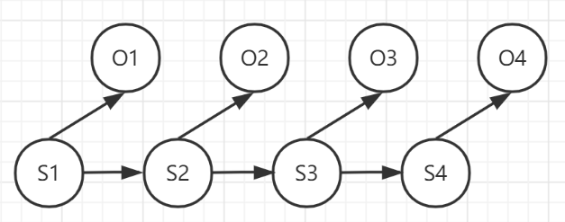
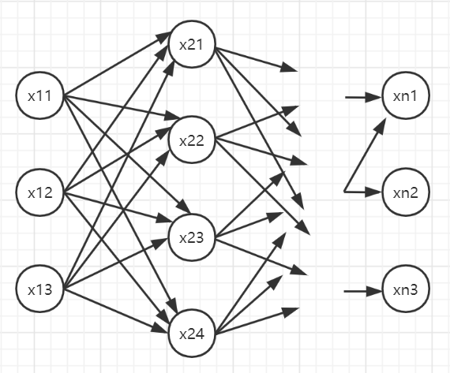
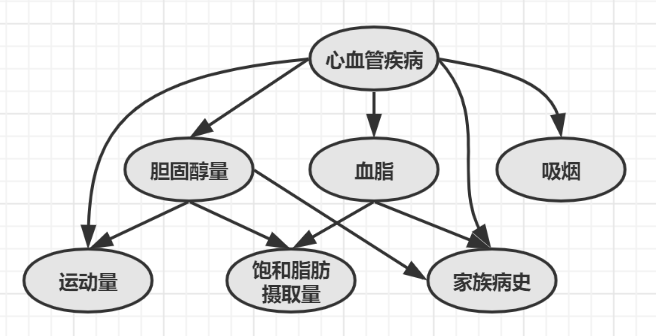

# 《数学之美》笔记

[TOC]

## 自然语言处理

### 1. 语言模型

**模型的解释：**

- 提出：(贾里尼克)一个句子是否合理，就看它的可能性大小如何，这个可能性用句子出现的概率来衡量。

- 定量：假设 S 表示一个有意义的句子，由一连串特定顺序的单词 $$w_1,w_2,...,w_n$$ 组成，S 出现的概率可用 **条件概率公式** 来计算：

$$
P(w_1,...,w_n) = P(w_1)\cdot P(w_2\mid w_1)\cdot P(w_3\mid w_1,w_2)\cdots P(w_n\mid w_1,...,w_{n-1})
$$

- 二元模型：**马尔科夫假设**——一个词出现的概率只和它前面的 **一个** 词有关。由此得出 **二元模型**：

$$
P(w_1,...,w_n)=P(w_1)\cdot P(w_2\mid w_1) \cdots P(w_n\mid w_{n-1})
$$

- 模型参数的计算方法：那么如何估计条件概率 $$P(w_i\mid w_{i-1})$$ 呢？根据公式 $$P(w_i\mid w_{i-1})=\frac {\#(w_{i-1},w_i)}{\# w_{i-1}}$$，从语料库中统计出 $$w_{i-1},w_i$$ 前后相邻出现的次数以及$$w_{i-1}$$ 出现的次数 $$\#(w_{i-1}),\#(w_{i-1})$$，即可计算。

- **三元模型**：一个词出现的概率只和它前面的 **两个** 词有关，这是最常用的模型。

- 马尔科夫假设的局限性：在自然语言中，上下文之间的相关性可能跨度很大，所以只是提高模型的阶数是不行的。

**模型训练：**

- 概念：模型中所有的条件概率叫做模型的参数，通过对语料库的统计，得到这些参数的过程叫做模型训练。

- 解决零概率问题——**古德-图灵估计**
  - 原理：对于没有看见的事件，不能认为其概率为零，需要 **从概率总量中分配一个小比例给这些事件**。
  - 注意：**对于频率超过一定阈值的词，概率不调低**，调低的只是频率小于该阈值的词——**出现越少，调低越多**。
  - 平滑方法：**卡茨退避法**。

---

### 2. 隐含马尔科夫模型

**模型解释**

- **马尔科夫链**：隐含马尔科夫模型是研究 **随机过程** 的，**马尔科夫假设** 就是随机过程中各个状态 $$s_t$$ 的概率分布只和它的前一个状态 $$s_{t-1}$$ 有关，即 $$P(s_t \mid s_1,...,s_{t-1})=P(s_t \mid s_{t-1})$$。符合马尔科夫假设的随机过程就称为 **马尔科夫过程**，也叫马尔科夫链。

- **马尔科夫模型**：基于马尔科夫链，但是任意时刻的状态 $$s_t$$ 是不可见的，所以只能通过观察到的一个状态序列 $$s_1,...,s_t$$ 来推测 **转移概率** 等参数。

  

- **独立输出假设**：隐含马尔科夫模型在每个时刻会输出一个符号 $$o_t$$，而且 $$o_t$$ 只和 $$s_t$$ 相关。

- **公式**：某个特定状态序列 $$s_1,\cdots,s_n$$ 产生输出序列 $$o_1,\cdots,o_n$$ 的概率为：

  $$P(s_1,\cdots,s_n,o_1,\cdots,o_n) = \Pi P(s_t\mid s_{t-1})\cdot P(o_t\mid s_t)$$.

**模型训练**

- **三个基本问题**：
  1. 给定一个模型，如何计算某个 **特定的输出序列的概率**。
  2. 给定一个模型和某个特定的输出序列，如何找到 **最可能产生这个输出的状态序列**。
  3. 给定足够的观测数据，如何 **估计隐含马尔科夫模型的参数**。
- **模型参数：**
  - **转移概率：**从前一个状态 $$s_{t-1}$$ 进入当前状态 $$s_t$$ 的概率 $$P(s_t\mid s_{t-1})$$.
  - **生成概率：**每个状态 $$s_t$$ 产生输出 $$o_t$$ 的概率 $$P(o_t \mid s_t)$$.
- **有监督的训练**：有足够多人工标记的数据，能够算出经过状态 $$s_t$$ 的次数 $$\#(s_t)$$ 和经过此状态产生输出 $$o_t$$ 的次数 $$\#(o_t)$$，然后通过条件概率公式 $$P(o_t \mid s_t) = \frac {\#(o_t, s_t)}{\#(s_t)}$$ 就能估计出生成概率。
- **无监督的训练**：**鲍姆-韦尔奇算法**，通过 **不断迭代** 不断估计新的模型参数，使得输出概率最大化，这被称为 **期望值最大化过程**，简称 EM 过程。

---

### 3. 维特比算法

维特比算法是一个 **动态规划** 算法，针对 **有向篱笆网络** 的最短路径提出，凡是利用 **隐含马尔科夫模型** 描述的问题都能用它来解码。

在上面的篱笆网络中，$$x_{ij}$$ 表示状态 $$x_i$$ 的第 $$j$$ 个可能的值。在该网络中，从第一个状态到最后一个状态的任何一条路径，都能产生我们观察到的输出序列 Y。当然，这些路径的可能性相互不同，我们的任务就是找到一条 **最可能的路径**。对于每一条给定的路径，容易计算出它们的可能性，但麻烦的是这样的路径组合数非常多,会让序列状态数呈指数增长。维特比算法就为解决这个问题而提出。

算法思想就是动态规划中自底向上、避免重复计算的思想。

### 4. 期望最大化算法

**文本的自收敛分类**：这种方法既不需要事先设定好类别，也不需要对文本两两比较进行合并聚类。而是 **随机挑出一些类别的中心，然后来优化这些中心，使它们和真实的聚类中心尽可能一致。** 这种方法依然要用到文本 TF-IDF 向量，和向量之间的余弦距离。假设有 N 篇文本，对应 N 个向量 $$V_1,\cdots,V_n$$，希望把它们分到 K 类中，下面是算法描述：

1. 随机挑选 K 个点，作为起始中心；
2. 计算所有点到这些聚类中心的距离，将这些点归到最近的一类中；
3. 重新计算每一类的中心；
4. 重复上述过程，直到每次新的中心和旧的中心之间的偏移非常非常小，即过程收敛。

### 5. 人工神经网络

**概念**：人工神经网络和人脑没有半点关系。它本质上是一种特殊的 **有向图**。人工神经网络也具有节点，只是有了一个新的名字——**神经元**，而有向弧则被看成连接神经元的 **神经**。下图就是一个典型的三层人工神经网络：

**结构**：

- 最下面的一层叫做 **输入层**——在各种应用中，模型的输入值只是赋给这一层的结点，其他各层结点的值都由输入层的值直接或间接得到。
- 最上面的一层叫做 **输出层**——模型的输出都从这一层而来。
- 其他各层称为 **中间层**，又叫 **隐含层**。

**基本原理**：输入层接收输入后，按照它们输出的弧的权重，进行某种特定的 **线性加权**，然后再做一次 **函数变换**，赋给第二层结点。第二层的结点也这样将数值向后传递，直到最后一层结点，此时哪个 **结点的数值最大**，输入的模式就被分在哪一类。

**设计**：需要设计的部分只有两个，一个是它的 **结构**——网络分几层、每层几个结点、结点之间如何连接等等；二是 **非线性函数** 的设计，常用指数函数。

**人工神经网络 vs 贝叶斯网络**：

- 相同之处：

  1. 都是有向图，每一个结点的取值都仅和前一级结点相关。

  2. 训练方法相似。

  3. 对于很多 **模式分类** 问题，效果相似。

  4. 训练计算量都特别大。

- 不同之处：

  1. 人工神经网络在结构上 **完全标准化**，而贝叶斯网络更灵活。
  2. 虽然神经元函数为非线性函数，但是各个变量只能先进行线性组合，最后对结果进行非线性变换，因此比较容易实现；而在贝叶斯网络中，变量可以组合成任意的函数，灵活却复杂。
  3. 贝叶斯网络更容易考虑上下文的相关性，因此可以 **解码一个序列**，比如将一段语音识别成文字，或者将一个英语句子翻译成中文。而人工神经网络的输出相对孤立，它可以 **识别一个个字**，但是很难处理一个序列。因此它主要的应用常常是估计一个概率模型的参数，而不是作为解码器。

---

## 互联网搜索

### 1. PageRank

**核心思想**：最简单来说，如果一个网页 **被很多其他网页所链接**，那么它的排名就高。但是实际上 PageRank 算法要复杂得多，比如 **对来自不同网页的链接区别对待**，因为那些 **排名高的网页中的链接更靠谱**，要给这些链接更大的权重。——那么问题出现了，给网页排名需要用到网页的排名，解决这个问题的方法是，先假定每个网页的排名是相同的，并且根据这个初始值，算出各个网页的第一次 **迭代** 排名，然后继续迭代。佩奇和布林从理论上证明了，无论初始值怎么选，这种算法都能保证网页排名的估计值 **收敛** 到真实值。

简化大矩阵计算：**稀疏矩阵计算** 技巧。

算法的高明之处在于它 **把整个互联网当做一个整体对待**，符合了 **系统论** 的观点。

### 2. 确定网页和查询的相关性

**关键词频率(Term Frequency)**：关键词出现的次数 / 网页总字数。度量网页和查询的相关性，一个简单方法就是 **使用各个关键词在网页中出现的总词频**。但是有两个条件：

1. 一个词 **预测主题的能力** 越强，权重越大。
2. **停止词** 的权重为 0.（停止词就是对确定网页主题没有用处的词）

问题：如果一个 **关键词只在很少的网页中出现**，通过它就容易锁定搜索目标，它的 **权重也就越大**。如果一个词在大量网页中出现，权重就越小。

**逆文本频率指数(IDF)**：$$\log(\frac {D}{D_w})$$，其中 $$D$$ 是全部网页数，$$D_w$$ 是包含关键词的网页数量。

### 3. 有限状态机

以分析地址文法为例，它是 **上下文有关文法** 中较为简单的一种，最有效的识别和分析方法是有限状态机。

有限状态机是一个特殊的 **有向图**，包括一些状态结点和连接这些状态的有向弧，下面的图就是一个识别中国地址的有限状态机的简单例子：

如果一条地址能从状态机的 **开始状态经过若干中间状态，走到终止状态**，则这条地址有效。

### 4. 余弦定理和新闻的分类

**特征向量**：对于一篇新闻中所有的词，计算出它们的 TF-IDF 值，把这些值按照对应的实词在词汇表的位置依次排列，得到一个 **代表该新闻的向量**，称为新闻的 **特征向量**。

**向量距离度量**：不同新闻，因为长度不同，特征向量各个维度的数值也不同，所以单纯比较各个维度的大小没有意义，但是，**向量的方向** 却很有意义——如果两个向量方向一致，说明相应的新闻 **用词比例** 基本一致——因此可以通过计算两个 **向量的夹角** 来判断对应的 **新闻主题的接近程度**。

### 5. 矩阵运算之奇异值分解

新闻分类乃至各种分类其实是一个聚类问题，关键是计算两篇新闻的 **相似程度**。为此要将新闻变成代表它们内容的实词，然后再变成一组数(向量)，然后求这两个向量的夹角——夹角很小时，相关性就很大；当两者垂直时新闻就无关。

从理论上讲这种算法非常漂亮，但是因为 **要对所有新闻做两两计算，而且要进行很多次迭代，耗时会特别长**，尤其是当新闻的数量很大且词表也很大的时候。所以我们希望有一个方法一次就能把所有新闻相关性计算出来，这个一步到位的方法利用的是矩阵运算中的 **奇异值分解**，简称 SVD。所谓奇异值分解，就是 **把一个大矩阵分成三个小矩阵相乘**。

### 6. 贝叶斯网络

在马尔科夫链中，每个状态值仅取决于前面有限个状态。对很多实际问题而言，这种模型是一种很粗略的简化。在现实生活中，很多事物的相互关系并不能用一条链串起来，很可能是交叉而错综复杂的。

在上图中，状态之间的连线表示因果关系。假定每个状态 **只跟和它直接相连的状态有关**，而跟与它间接相连的状态没有直接关系，那么这个网络就是 **贝叶斯网络**。——之所以叫贝叶斯网络，是因为每个结点的概率都能用 **贝叶斯公式** 来计算。

贝叶斯网络中的弧(因果关系)都有一个权重(可信度)，可以用概率描述，所以贝叶斯网络也被称作 **信念网络**。

贝叶斯网络可以用于词分类等场景，可以用贝叶斯网络建立一个文章、概念和关键词之间的关系。

---

