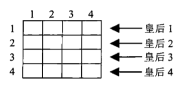
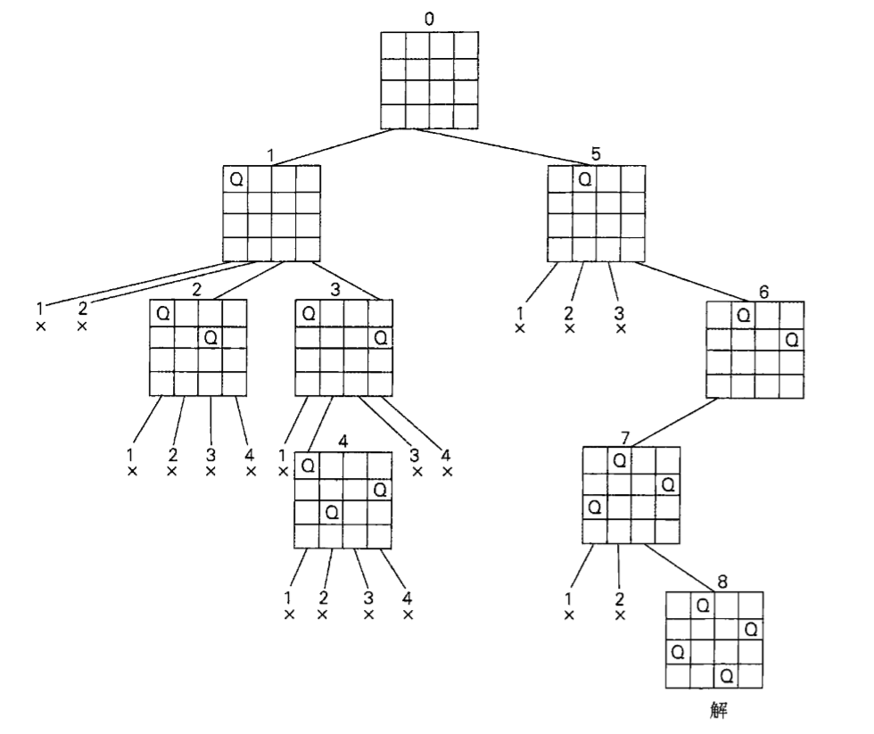
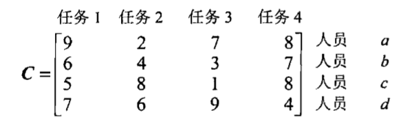
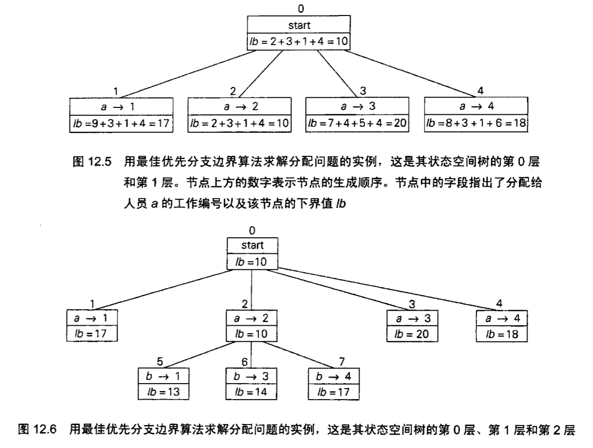
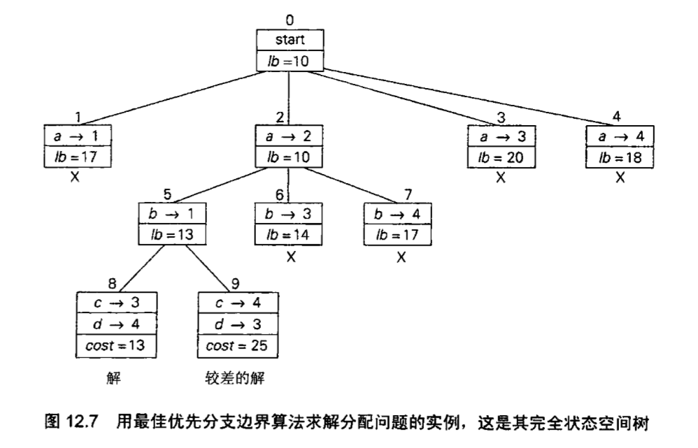
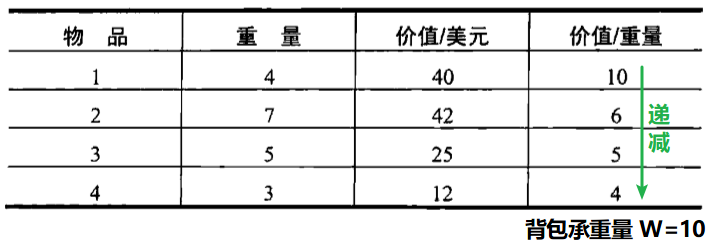
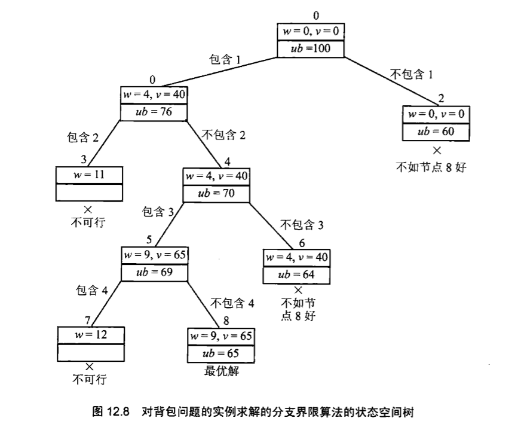

# 回溯法 & 分支界限法

这两种策略都是对穷举法的一个改进，和穷举查找不同的是，它们 **每次只构造候选解的一个分量**，然后评估这个部分构造解：如果加上剩下的分量也不可能求得一个解，则不会生成剩下的分量。

回溯法和分支界限法都是以构造一棵 **状态空间树** 为基础的。

## 回溯法

主要思想是每次只构造解的一个分量，然后按照下面的方法来 **评估这个部分构造解**：
- 如果它可以对下一个分量进行合法选择，就接受这个选择。
- 否则，就进行回溯，把部分构造解的最后一个分量替换为它的下一个选择。

所作的一系列选择构成一棵 **状态空间树**。

### n 皇后问题

问题要求把 n 个皇后放在一个 nxn 的棋盘上，任何两个皇后不同行不同列，不在同一对角线上。

考虑 n=4 的情况：

因为每个皇后分别占据一行，所以只需要确定每个皇后在哪一列即可：

1. 首先把皇后 1 放到它的第一个可能位置上，即左上角；
2. 开始放置皇后 2，先尝试放在它所在行(第二行)第一列上和第二列上，均失败；所以继续尝试放到第三列，暂时可以；
3. 开始放置皇后 3，四个可能位置均不行，所以 **进行回溯**，**将皇后 2 放到下一个可能位置**——第四列。
4. 重新放置皇后 3，放在所在行(第三行)第二列可以。
5. 开始放置皇后 4，四个可能位置均不行，所以继续 **回溯**，**把皇后 1 放到第二个位置**。
6. 继续类似的尝试，可得到最终解。
7. 停止。

下面是该问题的状态空间树：

**可以在线性时间内求解**。

---

## 分支界限法

和回溯法相比，分支界限法需要两个额外的条件：
- 对于每一个部分解，要提供一种方法计算出通过这个部分解繁衍出的任何解在目标函数上的 **最佳值边界**。
- 目前求得的最佳解的值。

根据这个信息，可以 **拿某个结点的边界值和目前求得的最佳解进行比较**——如果边界值不能超越目前的最优解，这个结点就是没希望的结点，立即终止。

### 分配问题

问题要求把 n 项工作分配给 n 个人，并使总成本最小。一个分配问题的实例是由一个 n 阶 **成本矩阵 C** 确定的，所以可以将原问题转述为：**从矩阵的每一行中选取一个元素，使得任何两个元素都不在同一列上，并使它们的和最小。**

实例：

状态空间树和树结点的生成顺序有关，不同于 **回溯法总是生成最近一个有希望结点的单个子女**，而是在当前树的未终止叶子中，选择其中 **最有希望的结点**(最佳下界)，并生产成本它的 **所有子女**。

状态空间树的第一行表示从矩阵第一行中选择了一个元素，即把一个任务分配给人员 a。此时有四个活叶子：
- 若把任务 1 分给 a，则从其余三行选出每行最小的元素，算出下界值为 9+3+1+4=17.
- 若把任务 2 分给 a，则下界值为 2+3+1+4=10.
- 若把任务 3 分给 a，则下界值为 7+4+5+4=20.（任务3就不能再分给剩余人员了）
- 若把任务 4 分给 a，则下界值为 8+3+1+6=18.

所以把任务 2 分给 a 是最有希望的，接下来从结点 2 开始扩展分支，开始给 b 分配任务。

第一和第二层的状态空间树如下：

此时 **从所有活叶子结点中选出下界最小的结点**，即结点 5，开始扩展分支。

产生结点 8 和 9 两个可行解，但是 9 的解成本大于 8 的解，所以被终止。

接着检查所有 **活叶子**(1,3,4,6,7)，发现它们的成本都大于 **目前的最优解**(8 的解)，所以都被终止。

### 背包问题

将各种物品按照 **每单位重量的价值** $$v_i/w_i$$ 来排序，使得 $$\frac{v_i}{w_i}>\frac{v_{i+1}}{w_{i+1}}$$.

在状态空间树中，每个结点记录一个 **总价值的上限值 ub**。

$$
ub=v+(W-w)(v_{i+1}/w_{i+1})
$$

- v 为已选物品的总价值；
- w 为已选物品的总重量。

实例：

状态空间树如下：

初始状态下，根的 ub=10x10=100,(0+(10-0)x(40/4))。
   -  根的左子女代表 **包含物品 1 的子集**，物品 1 的 w=4, v=40, 则结点 1 的上限值 ub=40+(10-4)x6=76.
   - 右子女表示 **不包含物品 1 的子集**，w=0, v=0, 则结点 2 的上限值 ub=0+(10-0)x6=60。
   - 结点 2 **更有希望**，所以从 2 开始继续扩展分支，得到结点 3 和 4. 3 表示 **包含物品 1 和 2** 的子集，4 表示 **包含物品 1 但是不包含 2** 的子集。
     - 结点 3 表示的每个子集的总重量超过了 W，立即终止结点 3.
     - 结点 4 的 **w、v 和它的父结点相同**(4,40)，ub=40+(10-4)x5=70.
       - 从结点 4 扩展得到 5、6。 从 5 扩展得到 7、8。
       - 8 为最优解。

> [!Tip]
> 树的每一个结点都可以代表给定物品的一个子集，在生成每一个新结点之后，都可以更新当前最佳子集。