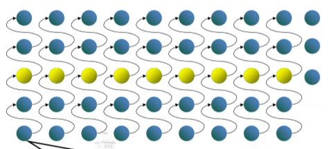
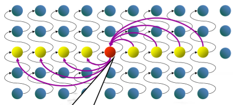

# 分而治之

[TOC]

---
****
**<mark>大整数乘法的优化算法</mark>**

通常计算 X*Y 的时间复杂度为 $$O(n^2)$$，下面是两种优化的尝试。其中第一种依然是 $$O(n^2)$$，而第二种达到了 $$O(n^1.6)$$.

**划分：** 将 X，Y 按位划分，X 的高 n/2 位和低 n/2 位分别记为 A 和 B，Y 的高 n/2 位和低 n/2 位分别记为 C 和 D。则有：

<center>$$XY=(A2^{n/2}+B)(C2^{n/2}+D)=AC2^n + (AD+BC)2^{n/2}+BD$$</center>

经过划分，共需计算 $$AC,\, AD, \, BC, \, BD$$ **四个乘法**（乘以 $$2^n$$ 只需移位即可），而每个乘法的时间复杂度为 **T(n/2)**，所以总的时间复杂性为 $$T(n)=4T(n/2)+\Theta(n)$$ 由 master 定理可得 $$T(n)=\Theta(n^2)$$.

**进一步划分：** 上面的划分并没有把时间复杂性降低，下面 **把四个乘法变成了三个：**

由于 $$AD+BC=(A+B)(C+D)-AC-BD$$，所以只需计算 $$(A+B)(C+D),\, AC, \, BD$$ 即可，变成了三个乘法。 

此时的递归方程变成了：$$T(n)=3T(n/2)+O(n)$$，解出 $$T(n)=O(n^{log3})$$.

---

**<mark>元素选取问题</mark>**

讨论如何 **在 O(n) 时间内从 n 个不同的数中选取第 i 大的元素。**

第一步——分组：每组五个数。

第二步——将每组排序后求出中位数。

<center> </center>

第三步——在各组中位数上递归调用算法，选出 **中位数的中位数 MoM**。(下标为 k)

第四步——根据 MoM 递归找出 **第 i 大的元素。**

<center> </center>

- 如果 i>k，则在后一部分递归选取第 (i-k) 大的数
- 如果 i<k，则在第一部分递归选取第 i 大的数。

---

**<mark>合并排序</mark>**

对于一个需要排序的数组 A[0...n-1]，先把它一分为二：A[0...$$\lfloor n/2 \rfloor - 1$$] 和 A[$$\lfloor n/2 \rfloor - 1$$...n-1]，然后分别递归排序，最后把两个排序好的子数组合并为一个数组。

合并时，两个指针初始状态下分别指向两个数组的第一个元素，然后比较这两个元素的大小，将较小的添加到一个新创建的数组中。接着，被复制数组中的指针后移，指向该较小元素的后继元素。直到某个数组被处理完，最后将未处理完的数组剩下的元素依次复制到新数组尾部。

键值比较次数 C(n) 的递推关系是(n>1)：$$C(n)=2C(n/2)+C_{merge}(n)$$. 其中 $$C_{merge}(n)$$ 指的是合并阶段键值比较次数，最坏情况下 $$C_{merge}(n)=n-1$$，所以有：

<center>
$$
C_{worst}(n)=2C_{worst}(n/2)+n-1
$$
</center>

根据 Master 定理，$$C_{worst}(n) \in \Theta (n \log n)$$.

合并排序是 **稳定** 的，但是需要 **额外存储空间**。

---

**<mark>快速排序</mark>**

快速排序同样要对元素进行划分，不同于合并排序的是，它是 __按照元素的值进行划分__，而不是按照位置划分。所谓划分，是指对给定数组中的元素重新排列，使得 __A[s] 左边的元素都小于等于 A[s]，右边的元素都大于等于 A[s]__。接着对左右两边进行递归划分。
- 在合并排序中，算法主要工作在合并子问题的解；
- 在快速排序中，算法主要工作在划分阶段，不需要合并子问题的解。

划分的关键是划分元素(中轴元素)的选择，可以简单将第一个元素作为中轴元素，然后 __从左往右找到一个比 pivot 大的元素，同时从右往左找到一个比 pivot 小的元素，交换这两个元素。最后将左右指针重合的那个元素和 pivot 交换。__

算法描述：
```
QuickSort(A[l..r]) {
    // 对 A[l..r] 这个子数组排序
    if l<r
        s ← Partition(A[l..r]) // s 是分裂位置
        QuickSort(A[l..s-1])
        QuickSort(a[s+1..r])
}

Partition(A[l..r])
    // 以第一个元素为中轴进行划分
    p ← A[l]
    i ← l; j ← r+1
    repeat
        repeat i ← i+1 until A[i]>=p
        repeat j ← j-1 until A[j]<=p
        swap(A[i],A[j])
    until i>=j
    swap(A[i],A[j]) // 当 i>=j时撤销最后一次交换
    swap(A[i],A[j])
    return j
```

平均效率和最好效率都为 __nlogn__，但是 __不稳定__。

---

**<mark>最近对问题</mark>**

设 P 为平面上 n 个点的集合，每个点不重合，且按 x 坐标升序排列。Q 同样是这些点的集合，但是按照 y 坐标升序排列。

利用点集在 x 轴方向上的中位数 m，在该处作一条垂线，将 P 分成大小分别为 $$\lceil n/2 \rceil$$ 和 $$\lfloor n/2 \rfloor$$ 两个子集 $$P_l$$ 和 $$P_r$$。然后就可以通过递归求解子问题 $$P_1$$ 和 $$P_2$$ 的解 $$d_l$$ 和 $$d_r$$，并定义 $$d=min{d_l,d_r}$$。

但是 d 不能肯定是最终解，因为距离最近的两个点可能分别位于分界线两侧。所以需要关注 **以分割线为对称轴的宽度为 2d 的垂直带中的点**。设 S 为来自 Q 且位于该垂直带中的所有点的集合，扫描 S，找出其中的最近对并和 d 比较。