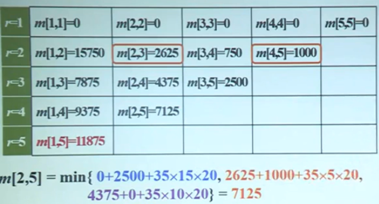
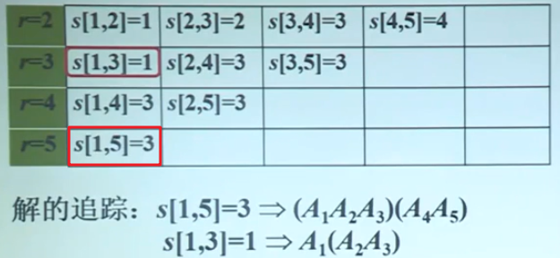
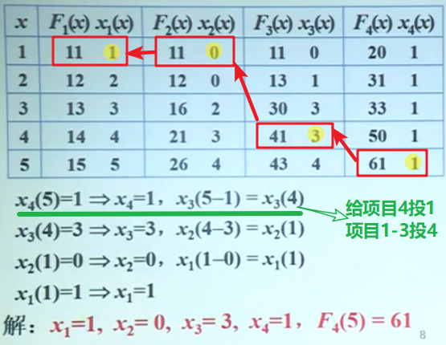
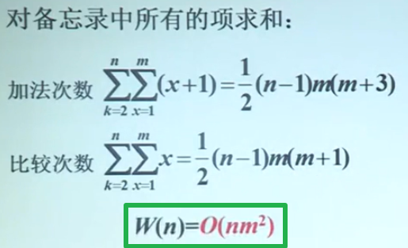
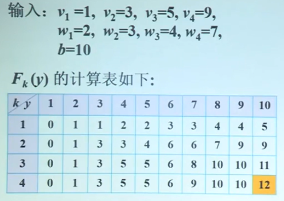
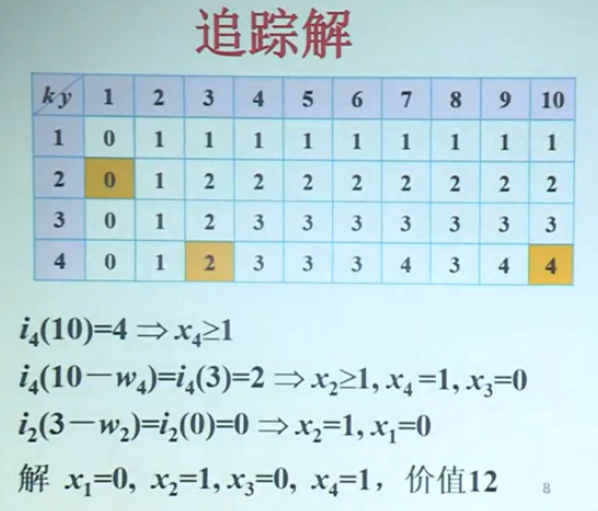

# 动态规划

[TOC]

**原理**

动态规划的求解过程是 **多阶段决策过程**，每步处理一个子问题。

一般来说，如果一个算法基于经典的自底向上动态规划方法，那就需要解出给定问题的所有子问题，同时利用 **记忆功能** 来避免对子问题重复求解。

动态规划主要用来解决最优化问题，**所有最优化问题任一实例的最优解，都是由其子实例的最优解构成的**。——最优化法则。

**动态规划的设计要素：**

- 界定子问题边界。
- 列出优化函数的 **递推方程** 及初值。
- 是否满足优化原则？

## 例子：矩阵链相乘

**问题：** 设 $$A_1, A_2, \cdots , A_n$$ 为矩阵序列，$$A_i$$ 为 $$P_{i-1} \times P_i$$ 阶矩阵。确定乘法顺序，使得元素相乘的总次数最少。

输入：$$P=<P_0,P_1,\cdots,P_n>$$，其中 $$P_0$$ 和 $$P_1$$ 分别为第一个矩阵的行数和列数，同时 $$P_1$$ 又是第二个矩阵的行数。

> 两个矩阵相乘基本操作的运算次数：若 A 为 ixj，B 为 jxk，则 **AB 的乘法次数为 ijk**。

**递归实现：**

1.子问题划分：

设子问题 $$A_{i..j}$$ 表示矩阵乘法链 $$A_iA_{i+a} \cdots A_j$$，并设其最好划分的运算次数为 m[i,j]。

2.子问题的依赖关系：

设最优划分的最后一次相乘发生在矩阵 k 的位置，即 $$A_{i..j}=A_{i..k}A_{k+1,..j}$$. 则子问题 $$A_{i..j}$$ 最优运算次数 **依赖于** $$A_{i..k}$$ 与 $$A_{k+1..j}$$ 的最优运算次数。

3.递推方程：

m[i,j] 为子问题 $$A[i..j]$$ 最小相乘次数。

$$
m[i,j] = \left\{ \begin{array}{ll} 
0, &  i=j \\ 
\min_{i\leq k < j}\{m[i,k]+m[k+1,j]+P_{i-1}P_kP_j\}, & i<j \end{array}\right.
$$

其中 $$P_{i-1}P_kP_j$$ 为 $$A[i..k]$$ 与 $$A[k+1..j]$$ 相乘的乘法次数。

从递推方程可知满足优化原则——m[i,j] 的最优值取决于子问题 m[i,k] 及 m[k+1,j] 的最优值。

4.分析时间复杂度：

$$
T(n)\geq \left\{ \begin{array}{ll}
    O(1), & n=1 \\
    \sum_{k=1}^{n-1}(T(k)+T(n-k)+O(1)), & n>1
\end{array}\right.
$$

即 $$T(n)\geq O(n)+\sum_{k=1}^{n-1}(T(k)+T(n-k))=O(n)+2\sum_{k=1}^{n-1}T(k)$$.

> T(k) 是指问题规模变成 k。

虽然比蛮力法效率高了一些，但是可以解出 T(n) 仍然是一个指数函数。因为在递归计算各个子问题时，一些子问题会被多次重复计算。

**迭代实现：**

0.关键：

- 每个子问题只计算一次。
- 迭代过程：
  - 从最小的子问题算起；
  - 考虑**计算顺序**，保证后面用到的值在前面已经计算好；
  - 存储结构保存计算结果——**备忘录**。
- 解的追踪：设计标记函数标记每步的决策。

1.矩阵链乘法的不同子问题：

- 长度为 1 的：只含有一个矩阵，不需要计算，有 n 个子问题；
- 长度为 2 的：含有两个矩阵，n-1 个子问题；
- ...
- 长度为 n-1 的：含 n-1 个矩阵，两个子问题；
- 长度为 n 的：原始问题。

2.迭代计算顺序：

1. 长度为 1：初值，m[i,i] 为 0；
2. 长度为 2：A1..A2,A2..A3,...,An-1..An；
3. ...
4. 长度为 n-1：A1..An-1, A2..An。
5. 原始问题。

3.算法实现：

```
MatrixChain(P,n)
    for r←2 to n do // r 为链长
        for i←1 to n-r+1 do // i 为左边界
            j←i+r-1 // j 为右边界
            m[i,j]←m[i+1,j]+p(i-1)p(i)p(j) // 此时 k=i
            s[i,j]←i // 标记 k(分隔位置)
            for k←i+1 to j-1 do // 遍历 k
                t←m[i,k]+m[k+1,j]+p(i-1)p(k)p(j)
                if t<m[i,j] // 更新解
                then m[i,j]←t
                    s[i,j]←k
```

4.时间复杂度分析：

因为有三层循环，所以计算的工作量为 $$W(n)=O(n^3)$$，另外，追踪解的工作量为 O(n)，所以总的工作量还是 $$O(n^3)$$.

**实例分析**

输入：P=<30,35,15,5,10,20>，即有五个矩阵。

备忘录：存储所有子问题的最优乘法次数，以及得到这个值的划分位置。



以计算 m[2,5] 为例，即计算第 2 到第 5 这四个矩阵相乘的最小乘法次数，那么可以有 3 种划分方法：

- 从 2 处分开——即 m[2,2] 和 m[3,5] 两部分，前一部分的乘法次数为 0，后一部分为 2500，将这两部分相乘的乘法次数为 35x15x20.(第二个矩阵为 35x15，第三到第五相乘结果矩阵为 15x20)
- 从 3 处分开——即 m[2,3] 和 m[4,5] 两部分。
- 从 4 处分开——即 m[2,4] 和 m[5,5] 两部分。

比较可知从 3 处分开的计算量最小，所以 m[2,5] 即为从 3
处分开的计算量。

标记函数：存着计算每个子问题时最优划分的位置。



---

## 投资问题

**问题**：m 元钱，n 项投资，$$f_i(x)$$ 为将 x 元投入第 i 个项目的收益，求使得总收益最大的投资方案。

**问题建模**

问题的解是向量 <x1,...,xn>，其中 xi 表示投给第 i 个项目的钱。

目标函数：$$\max \{f_1(x_1)+\cdots + f_n(x_n)\}$$.
约束条件：$$x_1+\cdots + x_n=m, x_i \in N$$.

**实例**：5 万元钱，4 个项目，效益函数如下表所示：


**子问题界定**

由两个参数 k、x 来界定：
- k 是对项目 k 的投资；
- x 是投资总钱数不超过 x。

**计算顺序**

原始输入：k=n, x=m

子问题计算顺序：k = 1,2,...,n. 对于给定的 k，x = 1,2,...,m.

**递推方程**

$$F_k(x)$$：表示 x 元钱投资给 **前 k 个** 项目的最大收益。

若知道 p 元钱投给 **前 k-1 个项目** 的最大收益 $$F_{k-1}(p)$$，就能推出问题的解。

$$
F_k(x)=\max _{0\leq x_k \leq x)}\{f_k(x_k) + F_{k-1}(x-x_k)\} \, k>1
$$

$$
F_1(x)=f_1(x)
$$

> 分解为投资个第 k 个项目 xk 元，和投给剩余项目 x-xk 元钱。

**k=2 时的计算示例**：

此时要考虑第 1 和第 2 两个项目。

1. x=1 时：
   - 方案一：第一个项目 0，第二个项目 1.
   - 方案二：第一个项目 1，第二个项目 0.
2. x=2 时：(0,2), (1,1), (2,0).
3. ...

**备忘录**



> x_i(x) 表示标记函数，记录在计算 **前 i 个** 项目时，给 **第 i 个** 项目的投资。

**时间复杂度**



**小结**

投资问题的动态规划算法：
- 用两个不同类型的参数界定子问题；
- 列出递推方程和初值；
- 确定子问题计算顺序；
- 根据备忘录计算时间复杂度；
- 时间复杂度 $$O(nm^2)$$。

---

## 背包问题

**问题**：给定 n 个重量为 w1,...wn，价值为 v1,...,vn 的物品，和一个容量 W 的背包，求这个背包能装下的物品的最大价值。

**建模**

解是向量 <x1,...,xn>，xi 表示物品 i 的个数。

目标函数：$$\max \sum _{i=1}^{n} v_i x_i$$

约束条件：$$\sum _{i=1}^{n}w_i x_i \leq W, \, x_i \in N$$

**子问题界定和计算顺序**

子问题界定：由参数 k 和 y 界定：
- k：考虑对物品 1,...,k 的选择
- y：背包所装物品的重量

计算顺序：k=1,...,n，对于给定的 k，y=1,...,b。

**递推方程**

导出递推关系，用较小子实例的解来表示原始问题的解。

$$F_k(y)$$ 表示达到最大价值时，装前 k 种物品，总重不超过 y。

$$F_k(y)=\max \{F_{k-1}(y),F_k(y-w_k)+v_k\}$$

$$F_0(y)=0,\, F_k(0)=0, F_1(y)=\lfloor y/w_1 \rfloor$$

**标记函数**

$$i_k(y)$$：装前 k 种物品，总重不超过 y，达到最大价值时装入物品的最大标号。

$$
i_k(y)= \left \{ \begin{array}{ll}
    i_{k-1}(y), & F_{k-1}(y)>F_k(y-w_k)+v_k \\
    k, & F_{k-1}(y) \leq F_k(y-w_k)+v_k
\end{array}\right.
$$

初值：

$$
i_1(y)=\left\{\begin{array}{ll}
    0, & y<w_1 \\
    1, & y\geq w_1
\end{array}\right.
$$

**实例**




**时间复杂度**：O(nb).

**动态规划总结：**

- 动态规划是一种对具有交叠子问题的问题进行求解的技术，一般来说，这样的子问题出现在求解给定问题的递推关系中，这个递推关系包含了相同类型的更小子问题的解。
- 对一个最优化问题应用动态规划方法要求问题满足 **最优化原则**：一个最优问题的最优解是由子问题的最优解组成的。
- 应用：
  - 背包问题
  - 投资问题
  - 最优二叉查找树
  - Floyd 算法