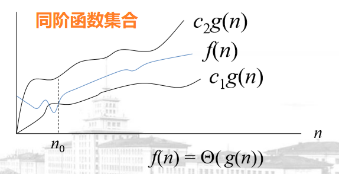
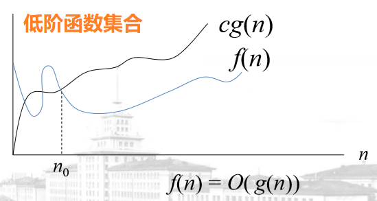
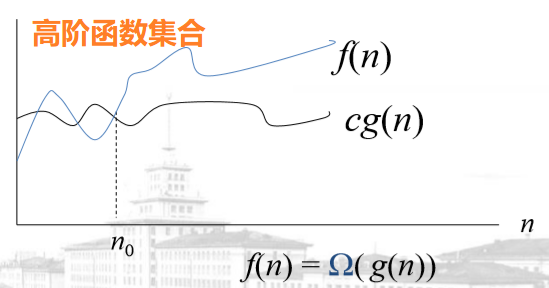
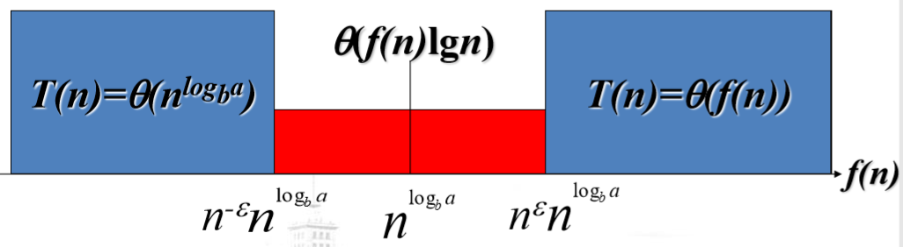

# 数学基础

[TOC]

---

## 计算复杂性函数的阶

**同阶函数集合 $$\Theta(g(n))$$**：

$$
\Theta(g(n))=\{f(n) \mid \exists c_1,c_2>0,n_0,\forall n>n_0,c_1 g(n)\leq f(n) \leq c_2g(n)\}
$$

上式表示所有 **和 $$g(n)$$ 同阶** 的函数的集合。如果 <mark>$f(n) \in \Theta (g(n))$</mark>，那么记作 <mark>$f(n)=\Theta (g(n))$</mark>。例如 $$an^2+bn+c=\Theta(n^2)$$。

**低阶函数集合 $$O(g(n))$$**：

$$
O(g(n))=\{f(n) \mid \exists c,n_0 > 0, \forall n \geq n_0,0 \leq f(n) \leq cg(n) \}
$$

上式表示所有 **比 $$g(n)$$ 低阶** 的函数的集合。如果 <mark>$f(n) \in O(g(n))$</mark>，那么记作 <mark>$f(n)=O(g(n))$</mark>。

 

**$$\Theta$$ vs $$O$$**：

- $$O$$ 表示渐进 **上界**；(<mark>最坏复杂度</mark>)
- $$\Theta$$ 表示渐进 **紧界**。
- $$f(n)=\Theta(g(n)) \Rightarrow f(n)=O(g(n))$$。
- $$an^2+bn+c=\Theta(n^2) = O(n^2)$$。
- $$an+b=O(n^2), n=O(n^2)$$。

**高阶函数集合 $$\Omega(g(n))$$**

$$
\Omega (g(n))=\{f(n) \mid \exists c,n_0>0, \forall n \geq n_0, 0 \leq cg(n) \leq f(n)\}
$$

- $$\Omega$$ 表示渐进 **下界**。（<mark>最好复杂度</mark>）
- 当且仅当 $$f(n)=O(g(n)) \wedge f(n)=\Omega (g(n))$$，$$f(n)=\Theta(g(n))$$。

**一个定理：**

如果 $$t_1(n) \in O(g_1(n)), t_2(n) \in O(g_2(n))$$，则 $$t_1(n)+t_2(n)=O(max\{g_1(n),g_2(n)\})$$.

---

## 和式的估计和界限

**线性和：**

$$\sum _{k=1}^{n}(ca_k+b_k)=c \sum _{k=1}^{n}a_k + \sum _{k=1}^{n}b_k$$

**级数：**

- $$\sum _{i=1}^{n} i = \Theta(n^2)$$

- $$\sum _{k=0}^{n} = \frac {x^{n+1}-1}{x-1}$$

- $$\sum _{k=0}^{\infty}x^k = \frac {1}{1-x}$$

- $$\sum _{k=1}^{n} \frac {1}{k} = ln n + O(1)$$

---
## 递归方程

**求解递归方程阶数的方法：**

- **替换方法**：猜想 → **归纳法**。
- **迭代方法**：把方程化为一个 **和式** → 估计和。
- **Master 定理**：求解型为 **T(n)=aT(n/b)+f(n)** 的递归方程。

### 替换方法

例 1. 求解 $$2T(\frac {n}{2} + 17) + n$$.

**猜测 1**：当 n 充分大时，$$T(\frac {n}{2} + 17)$$ 与 $$T(\frac {n}{2})$$ 差别不大，所以可以猜 $$T(n)=O(n lgn)$$.

**猜测 2**：容易知道 $$T(n)=\Omega(n), T(n) = O(n^2)$$。然后 **逐阶地降低上界、提高下界**（逼近）=> <mark>$$O(nlogn)$$</mark>.

**证明**：用数学归纳法。

**变量替换：** 把复杂的递归方程换为熟悉的方程。

例 2. 求解 $$T(n)=2T(\sqrt{n})+lgn$$.

解：令 $$m = lgn$$，则 $$n=2^m, T(2^m)=2T(2^{\frac {m}{2}})+m$$.

再令 $$S(m)=T(2^m)$$，则 $$T(2^ \frac {m}{2})=S(\frac {m}{2})$$. 于是 $$S(m)=2S(\frac m 2)+m$$.

由上例结果可知 $$S(m)=\Theta(mlgm)$$，代回可得 $$T(2^m)=\Theta(mlgm)$$.

进一步根据 m 和 n 的关系代回可得 $$T(n)=\Theta(lgn \times lg(lgn))$$.

### 迭代方法

1. 循环地展开递归方程；
2. 转化为和式；
3. 求和。

### Master 定理

设 $$a \geq 1, b > 1$$，$$f(n)$$ 是一个函数，<mark>$$T(n)=aT(\frac {n}{b})+f(n)$$</mark>. 则 T(n) 可以如下求解：

- 若 <mark>$$f(n)=O(n^{log_b {a-\varepsilon}}),\varepsilon > 0$$</mark> 是常数，则 <mark>$$T(n)=\Theta(n^{log_b a})$$</mark>.
- 若 <mark>$$f(n)=\Theta(n^{log_b a})$$</mark>，则 <mark>$$T(n)=\Theta(n^{log_b a}lgn)$$</mark>.
- 若 <mark>$$f(n)=\Omega(n^{log_b a + \varepsilon})$$</mark>，则 <mark>$$T(n)=\Theta(n)$$</mark>.

**<mark>直观理解的话</mark>**，就是拿 $$f(n)$$ 和 $$n^{log_b a}$$ 比阶：

- 若 $$n^{log_b a}$$ 大，则 $$T(n)=\Theta(n^{log_b a})$$.
- 若 $$f(n)$$ 大，则 $$T(n)=\Theta(f(n))$$.
- 若同阶，则 $$T(n)=\Theta(f(n)lg n)$$.

> [!Warning]
> 对于图中红色部分，master 定理不适用。

例 1. 求解 $$T(n)=9T(\frac n 3)+n$$.

解：

$$a=9, b=3, n^{log_b a}=\Theta(n^2)$$.

$$\because f(n)=n=O(n^{log_b a - \varepsilon}), \varepsilon=1$$

$$\therefore T(n)=\Theta(n^{log_b a})=\Theta(n^2).$$

__结论：__

1. <mark>$$n^{\frac 3 4}logn=O(n)$$</mark>
2. <mark>$$f(n)+o(f(n))=\Theta (f(n))$$</mark>
3. <mark>$$1+\frac 1 2 + \cdots + \frac 1 n=O(n)$$</mark>