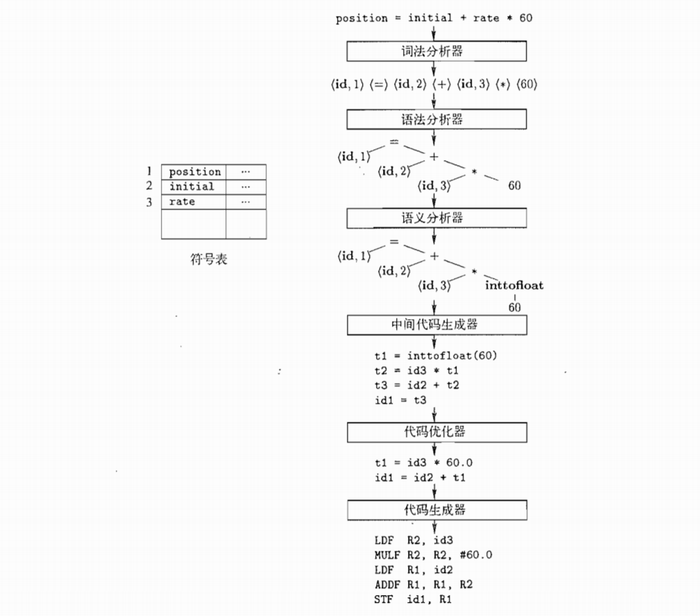

# 编译原理入门

**语言处理系统：**源程序→预处理器→**编译器**(生成 **汇编程序**)→**汇编器**(生成 **可重定位机器代码**)→**连接器**(生成 **目标机器代码**)。

**编译器的结构：**

- **分析部分（前端）**：把源程序分解成为多个组成要素，并在这些要素之上加上 **语法结构**，然后用这个结构来创建该源程序的一个 **中间表示**。如果分析部分检查出源程序没有按照正确的语法构成，或者语义上不一致，就会 **提供有用的信息帮助用户改正**。分析部分收集有关源程序的信息存放于 **符号表** 这个数据结构中，将符号表和中间表示一起传送给综合部分。
- **综合部分（后端）**：根据中间表示和符号表中的信息来构造用户期待的 **目标程序**。

**编译步骤**：

1. **词法分析**：词法分析器读入源程序的字符流，并将它们组织成 **词素序列**，对于每个词素，产生 **词法单元** 作为输出，词法单元为 **<标识符名字，在符号表中的位置>**。

2. **语法分析**：使用各个词法单元的第一个分量构建 **树形的中间表示**，该表示给出了词法分析产生的词法单元流的 **语法结构**。常用的表示方法是 **语法树**，树中每个 **内部结点** 表示一个 **运算**，而运算结点的 **子结点** 表示该运算的 **分量**。

3. **语义分析**：使用语法树和符号表中的信息来检查 **源程序是否和语言定义的语义一致**。同时收集 **类型信息**，并把这些信息存放在语法树或符号表中，以便在随后的中间代码生成过程中使用。

4. **中间代码生成**：在源程序的语法分析和语义分析完成之后，生成了一个 **明确的低级的或类机器语言的中间表示**，该中间表示有两个重要性质：易于生成，且易于被翻译成目标机器上的语言。**三地址代码** 就是这样一种中间表示。

5. **代码优化**：机器无关的代码优化步骤试图 **改进中间代码**，以便生成更好的目标代码。

6. **代码生成**：代码生成器以源程序的中间表示形式作为输入，并把它 **映射到目标语言**。一个重要方面是 **合理分配寄存器以存放变量的值**。

   

7. **符号表管理**：符号表数据结构 **为每个变量名字创建了一个记录条目**，记录的字段就是名字的各个属性，这个数据结构应该允许编译器迅速查找到每个名字的记录，并向记录中快速存放和获取记录中的数据。

8. **编译器构造工具**：

   - 语法分析器的生成器：根据一个程序设计语言的 **语法描述** 自动 **生成语法分析器**。
   - 扫描器的生成器：根据一个语言的语法单元的正则表达式生成 **词法分析器**。
   - 语法制导的翻译引擎：生成一组用于 **遍历分析树** 并生成中间代码的例程。
   - 代码生成器的生成器：根据一组把中间语言翻译成目标机器语言的规则，生成 **代码生成器**。
   - 数据流分析引擎：帮助分析程序中的值如何传递。
   - 编译器构造工具集。

**编译器设计和实现中的建模**：

- 有穷状态自动机和正则表达式：描述程序的词法单位，以及描述被编译器用来识别这些单位的算法。
- 上下文无关文法：描述程序设计语言的语法结构。
- 树形结构：表示程序结构以及程序到目标代码的翻译方法。

**编译器优化要满足的目标**：

- 必须是正确的。
- 必须能够改善很多程序的性能。
- 所需时间必须合理。
- 所需的工程方面的工作必须是可管理的。