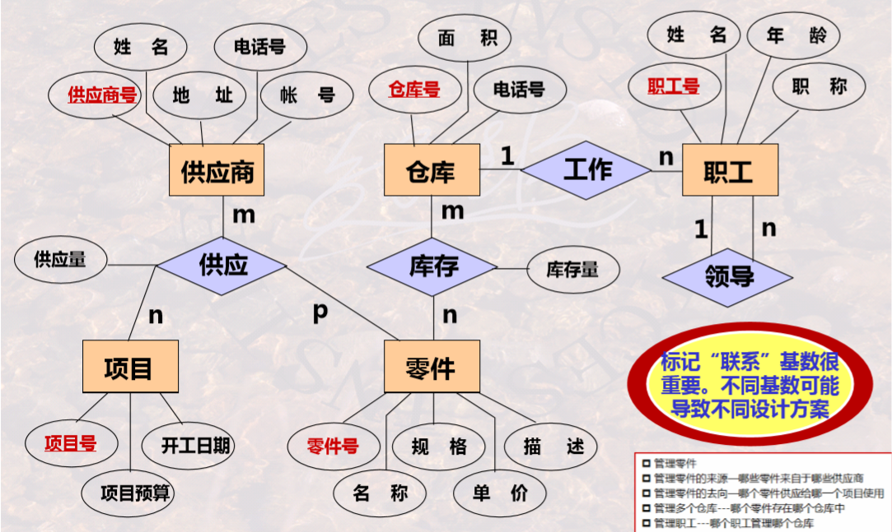
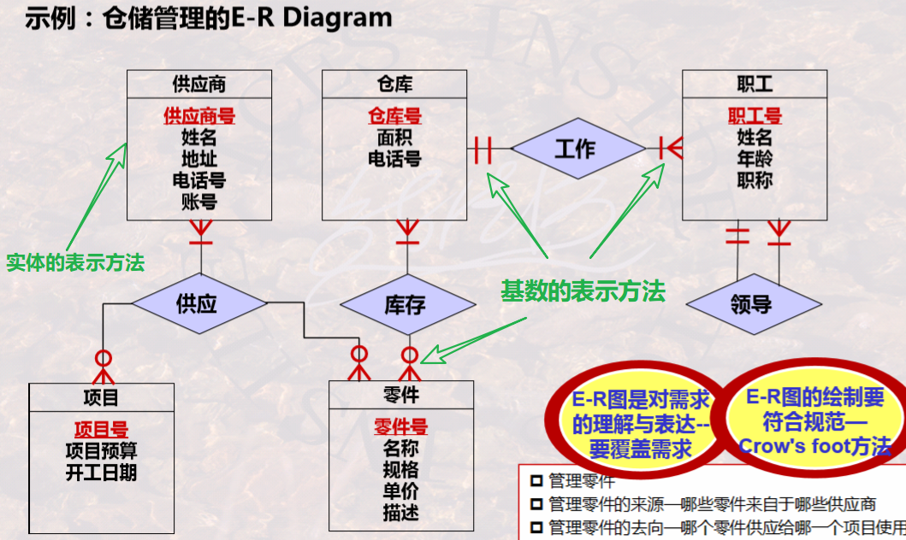
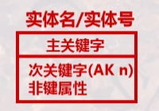
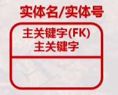
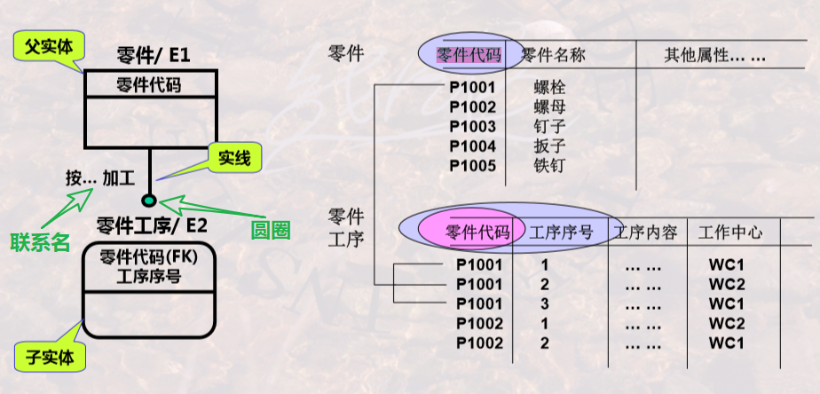
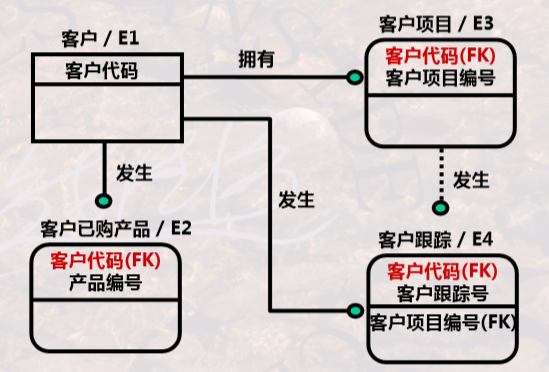
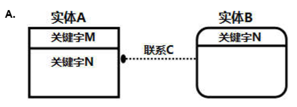
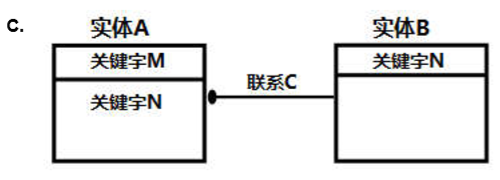
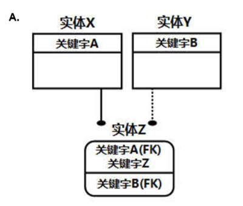
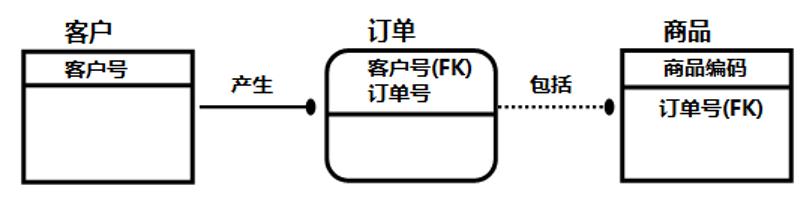

# 数据建模

[TOC]

## 📚 思想与方法

**数据模型 vs 概念模型**：

- 数据模型：用来表达计算机世界，包括关系、网状、层次模型。
- **概念模型**：用来表达信息世界，包括 **E-R 模型**。

E-R 模型基本思想：世界是由一组称作 **实体** 的基本对象和这些对象之间的 **联系** 联系构成的。

**基本概念**：

- 实体：一类实体（实体），一个个实体（实例）。
- 属性：实体具有的某一方面的特性。
- 关键字/码：用来区分不同实例。
- **联系**：有一元联系、二元联系、多元联系。
  - 基数：一个实体的实例，通过一个联系，能与多少个另一实体中的实例相联系。
  - **完全参与联系：**该端实例至少有一个参与到联系中，**最小基数为 1。**
  - **部分参与联系：**该端实例可以不参与联系，**最小基数为 0。**

**Chen 方法**：

- 实体：矩形框
- 属性：椭圆
- 关键字：下划线
- 联系：菱形框

**Chen 方法的步骤**：确定实体→标注属性→确定关键字→确定联系→标记联系的基数。

示例：

**crow's foot 方法** 对联系基数的表达：

**crow's foot 方法示例：**

---

📑 **习题**：

1. 在发现联系的过程中重点是联系 **基数的判定**。
2. 不能用“**一个个**”这样的词修饰的就不是实体。
3. 男人——婚姻——女人 这个联系中，指向男人的基数为 0...n。
4. 模型 vs 元模型：
   - 元模型是对模型的抽象，而模型是对现实世界的抽象；
   - 相比元模型，模型是由一组具体概念及其之间关系构成的。

---

## 🪓 工程化方法IDEF1x

**基本概念**：

- 实体：

  - **独立实体**(强实体)：关键字属性是自身的属性。用 **直角方框** 表示。

  - **从属实体**(弱实体)：关键字属性包含继承自其他实体的属性。用 **圆角方框** 表示，主关键字含有外键。

    &nbsp;&nbsp;

- 联系：

  - 标定联系
  - 非标定联系
  - 分类联系
  - 非确定联系

- 属性：属性、主码、候选码、外码。

**标定联系 & 非标定联系：**

- 一个确定性联系总是存在一个父实体一个子实体。

- 子实体与父实体总是 1 对 1，而父实体可以对应 0 或多个子实体。（标定联系、非标定联系都反应 **一对多(含一对一)** 联系）。

- **标定联系：**父实体的主键是子实体主键的一部分（**主键继承主键**）。用 **实线** 表示，在子实体一侧画上圆圈，联系名写在直线旁。

  

- **非标定联系：**父实体的主键不是子实体主键的一部分（非主键继承主键）。用 **虚线** 表示，同样标上圆圈和联系名。

  

**非确定联系**：

- 即实体间 **多对多** 的联系。

- 必须 **分解为若干个一对多** 的关系来表达，为此引入 **相交实体**（或称 相关实体）。

  

- 确定/非确定联系的区别：

  - 确定性联系通过 **属性继承** 实现两实体之间的联系。
  - 非确定联系通过 **引入相交实体** 实现两实体之间的联系。

**分类联系**：一个实例由一个 **一般实体** 的实例和多个 **分类实体** 的实例构成。**分类实体与一般实体具有相同的主键。**

- **完全分类联系**：用一个圆圈和两条横线表示。（类分完了，不能再分其他类了）

- **非完全分类联系**：用一个圆圈和一条横线表示。

  

  > [!Warning]
  >
  > 分类实体必须要有 **特有的属性**，否则分类无意义。

**IDEF1x 建模示例：**

 **IDEF1x 读图：**

✅ **实体** 能否用 **“一个个”** 修饰——否则就不是实体。

✅ 实体之间是否有 **从属关系**——是否要画成 **圆角矩形**？

✅ **方框内** 横线上的属性是不是 **关键字**？

✅ 各个实体之间应有 **联系**。

✅ **联系的方向**——**圆圈** 是否画在多端？

✅ **属性继承**——**虚线**(非标定联系)、**实线**(标定联系)是否正确？

✅ **分类实体的关键字** 和一般实体的关键字要一致；每个 **分类实体** 应有不同于其他分类实体及一般实体的 **属性**。

---

📑 **习题**

1. 关于 IDEF1x 中的联系和实体：

   - 实体将来要转换成关系模式，联系只有辅助阅读的作用。
   - 通过 **属性继承** 在两个实体之间建立连接关系。

2. 分析下面四个图的正确性：

    

    

   - A：实体 A 的一般属性继承了实体 B 的关键属性，**并非 B 的关键属性继承自实体 A 的关键属性**，实体 B 也就不是实体 A 的 **从属实体**，所以实体 B 不能画成 **圆角矩形**。 
   - B：应该是 **多端继承一端的关键属性**，而这里画反了。
   - C：**标定联系对应实线**，而这里 A 的一般属性继承了 B 的关键属性，是 **非标定联系，要用虚线**。
   - D：圆圈画在多端(子实体)，且是非标定联系，要用虚线，均正确。

3. 若要用 IDEF1X 表达实体X与实体Y之间的多对多的联系，引入一个相交实体 Z。则如果要表达 **实体X的实例和实体Y的实例的一个组合，可以出现多次的情况**，且 **实体 X和实体Y的实例均不能以空值组合出现**，IDEF1X图绘制正确的是____________。

    

    

   - A：这里实体 Z **在一般属性继承了实体 Y 的关键属性**，可以为空值；而要求 X 和 Y 都不能是空值。A、D错。
   - B：实体 Z 在关键属性继承了 X 和 Y 的关键属性，且关键属性还包括了其他属性，所以一种组合可以出现多次。正确。
   - C：关键字除了继承 X 和 Y 的主键之外没有其他属性，所以不满足“一种组合可以出现多次”。

4.  在某企业，通常 **多种物资可以一次性入库**，填写一张入库单，则表达“入库单”与“物资”实体联系的IDEF1X图，相比之下最正确的是____________。

    

   

   - B：因为入库单明细的 **主键仅仅继承了入库单的主键**，所以一张入库单明细对应一张入库单，同时对应一种物资——一张入库单对应一种物资，而要求多种物资可以一次入库。所以错误。
   - C：单从入库单明细的 **主键继承** 上来说，实现了入库单和物资的一对多联系，但是因为入库单明细 **在主键继承了物资的主键**，所以应该是 **标定联系**——是 **实线**——所以错误。
   - D：相关实体 **主键除了继承入库单之外**，还有 **序号** 属性，也实现了入库单和物资的一对多联系，同时 **在一般属性继承了物资主键**，是 **非标定联系**——使用 **虚线**——正确。

5. 下图表示的含义是：

   

   - 首先只看图形，订单是圆角的，“产生” 联系是实线，商品是直角的，“包括” 联系是虚线。因为 **订单实体在关键属性中继承了客户实体的全部关键属性**，所以订单实体是 **从属实体**——要用圆角，该联系是 **标定联系**——要用实线。而商品实体 **在普通属性中继承了订单实体的部分关键属性**，所以商品是 **独立实体**——要用直角，该联系是 **非标定联系**——要用虚线。
   - 然后看语义，从 **主键继承** 可知，一个客户号可以对应多张订单，而一张订单只能对应一个客户号。一件商品由商品编码唯一确定，而商品编码就是商品实体的主键，所以 **一个商品编码最多对应一个订单号**——即一件商品只能对应 0（订单号为空） 或 1 张订单；而商品继承的只是订单的部分关键字（订单号），**不同客户号相同订单号的订单（不同的订单），可以对应同一种商品。**

