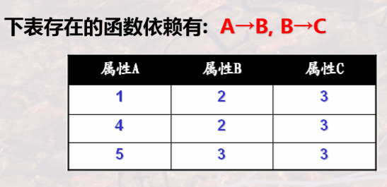
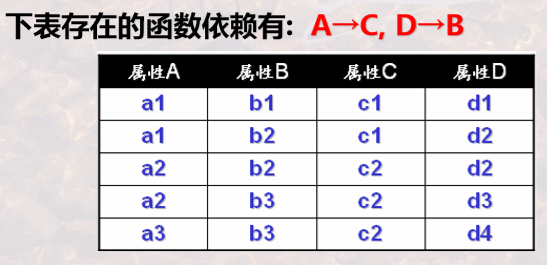

# 数据库设计

[TOC]

## 🔧 设计过程

**数据库设计的四个过程：**

1. 需求分析
2. 概念数据库设计：建立概念模型——E-R 图或 IDEF1x 图。
3. 逻辑数据库设计：建立逻辑模型——关系模式(概念模式+外模式)，表的定义、表中数据项的定义。
4. 物理数据库设计：建立物理模型——Create Table(利用具体的 DBMS 创建表)。

⭐ **<mark>E-R图/IDEF1X图向关系模式的转换</mark>**

🔵 **实体和属性的转换：** 实体转换为关系，实体的属性转换为关系的属性——例如“读者借阅图书，图书保存于书架”这个联系中，图书可以转换为关系：**图书(<u>书号</u>，书名，出版社)**；读者可以转换为：**读者(<u>借书证号</u>，姓名，住址)**。

- **弱实体的转换**：转换成的关系的关键字由该弱实体本身的 **区分属性** 加上所依赖的 **强实体的关键字** 构成。例如 *产品* 这个弱实体需要依赖 *公司* 这个强实体，那么产品转换成的关系就是 **产品(<u>产品名</u>,<u>公司名</u>,价格)**。
- **泛化实体和具体化实体的转换**：高层实体（泛化实体）和低层实体（具体化实体）分别转换为 **不同的关系**，**低层实体所对应的关系包括高层实体的关键字。** 例如 *学生* 实体可以细化成 *本科生* 和 *研究生*，那么这三个实体可以转换为三个关系：**学生(<u>学号</u>，姓名)**，**本科生(<u>学号</u>，军训)**，**研究生(<u>学号</u>，论文)**。但是如果具体化实体加起来等于泛化实体，那么泛化实体就无需转换为一个关系，例如前面这个学生的例子里面，*学生* 实体就无需转换，只需要 *本科生* 和 *研究生*。

🔵 **特殊属性的转换**：

- **复合属性**：可将每个 **分量属性** 作为复合属性的替代；也可对复合属性本身 **保持原样** 不做分解。例如学生的 **出生日期** 属性包括 **年、月、日** 三个分量，所以学生这个实体可以转换为：**学生(<u>学号</u>，姓名，出生日期)** 或者 **学生(<u>学号</u>，姓名，年，月，日)**。
- **多值属性**：将多值属性与所在实体的关键字一起组成一个 **新的关系**。例如学生实体有 **所选课程** 这一多值属性，那么需要转换为两个关系：**学生(<u>学号</u>，姓名)** 和 **选课(<u>学号</u>，<u>所选课程号</u>)**。

🔵 **联系的转换**：

- **一对一：**

  - 联系 **双方均部分参与**，则将联系定义为一个 **新的关系**，包含联系 **双方的关键字** 作为属性。
  - **一方全部参与**，则将 **另一方的关键字** 作为 **全部参与一方关系的属性。**

- **一对多**：将 **单方实体** 的 **关键字**，作为 **多方实体** 转换成的关系的 **属性**。

  

- **多对多**：**将联系定义为新的关系**，属性为双方实体的关键字。

  

🔵 **多元联系的转换**：**将联系本身作为一个关系**，其属性包括 **参与联系的各个实体的关键字**，还可以加上额外的 **区分属性**。

🔵 **IDEF1x 图的转换：** **只需将实体转换为关系**，无需关注联系。分类联系的转换和前面的具体化和泛化转换一样，复合属性和多值属性的转换也一样。

**数据库设计原则**：✅ 数据依赖； ✅ 关系范式； ✅ 模式分解。

---

📑 **习题：**

1. 在 **逻辑设计** 阶段进行 **关系模式的规范化** 处理。
2. **一对多** 转换时，多方实体的属性继承单方实体的关键字。
3. **多对多** 转换，除了将各个实体转换为关系外，还需要将联系转换为关系。

---

## 🧬 函数依赖

### 函数依赖

🔵 **函数依赖**：是一种 **唯一决定** 关系——在一个关系(Table)中，一个属性值(例如主键)能 **唯一确定另外一个属性的值**。假如主键为 X，另一个属性为 Y，则 X 能够决定 Y 的值，称 X **函数决定** Y，或 Y **函数依赖于** X，记作 X→Y。

 

🔵 **非平凡函数依赖**：如果 **X→Y**，且 **Y ∉ X**，则称该依赖为非平凡的函数依赖。

🔵 **完全函数依赖**：对于 X→Y，如果 **X 的任何真子集 X'，都不能唯一决定 Y**，则称 Y 完全函数依赖于 X。记为 ,否则称 Y 部分函数依赖于 X，记为 。例如 ,。

🔵 **传递函数依赖**：若 **X→Y，Y→Z，且 Y ∉ X，Z ∉ Y，Z ∉ X，Y不能决定X**，则称 Z 传递函数依赖于 X。

⭐ **重要概念**：

- **候选键**：和前面的候选键概念一样，能够 **唯一确定一个元组**，从中任选一个可以作为 **主键**，候选键包含的属性叫做 **主属性**。
- **外来键**：同样和之前对外键的定义一样，是其他关系的候选键，但不是此关系的候选键。
- **逻辑蕴含**：设 F 是关系模式 R 中 **函数依赖的集合**，X、Y 是 R 中的两个属性集合，若**从 F 中能推出 X→Y**，则称 **F 逻辑蕴含 X→Y**，或称 X→Y 是 F 的逻辑蕴含。
- **闭包**：F 逻辑蕴含的 **所有函数依赖的集合**称为 **F 的闭包**，记作 **F+**。
- **属性闭包**：根据函数依赖集合 F，能够推导出给定属性集(例如 A1，A2)所能推出的其他若干属性，这些推出的属性和(A1，A2)组合在一起的集合，叫做**（A1，A2）关于 F 的属性闭包。**

### 公理/定理

**阿姆斯特朗定理**：设 R 是属性集 U 上的一个关系模式，F 是一组函数依赖。

- **自反律**：**Y 含于 X 含于 U** => **X→Y 被 F 逻辑蕴含**。
- **增广律**：**X→Y∈F，Z 含于 U，则 XZ→YZ 被 F 逻辑蕴含**。
- **传递律**：**X→Y∈F，且 Y→Z，则 X→Z 被 F 逻辑蕴含。**

> [!Tip]
>
> 公式作用是从 **已知的函数依赖** 推导出 **隐含的函数依赖**。

**推论：**

- **合并律**：**X→Y 且 X→Z，则 X→YZ。**
- **伪传递律**：**X→Y 且 WY→Z，则 XW→Z**。 
- **分解律**：**X→Y 且 Z 含于 Y, 则 X→Z。**

**最小覆盖**：函数依赖集 F 若满足以下条件，则称 F 为最小覆盖或最小依赖集。

1. F 中每个函数依赖的 **箭头右边都是单个属性**。
2. 对任何的X→A∈F，有 **F - {X→A} 不等价于 F**。(不可或缺)
3. 对任何的X→A∈F，Z 含于 X，**(F-{X→A})∪{Z→A} 不等价于 F**。(无多余属性)

---

📑 **习题：**

1. 能够 **决定所有其他属性** 的才是**候选键**。
2. 符合 **传递律** 不一定就是 **传递函数依赖**，传递函数依赖条件更严格。
3. 候选键能唯一确定其他所有属性值。
4. A→C，B→C，则 AB→C。
5. A 含于 AB，所以 AB→A。
6. 检查是否为最小覆盖的方法：
   1. 检查每一个依赖是否 **不可缺少**；
   2. 检查每一个依赖是否有 **多余属性**。

---

## 🧮 关系范式

**第一范式**：关系模式中关系的 **每个属性都是不可分的数据项**，则称该关系模式满足第一范式，记为 R∈1NF。（关系中 **不能有复合属性、多值属性**。）非 1NF 转换为 1NF 的方法：

- **复合属性** 只保留该属性自身(不再有下一层)，或只保留下一层的细分值；
- **多值属性** 和关键字组成一个新的关系。

**第二范式**：R 在满足第一范式的前提下，每个 **非主属性都完全依赖于候选键**，则称 R∈2NF。（非主属性若对候选键存在部分依赖，则不满足第二范式。）

- 不满足第二范式的例子：R(学号，姓名，课程，成绩) 关系中，**候选键** 是 (学号，课程)，但是 **姓名部分依赖于该候选键**，所以不满足。
- 非 2NF 转换为 2NF 的方法：将原关系 **分解为多个关系**，例如将上例分解成两个关系：R(学号，姓名) 和 R(学号，课程，成绩)。

**第三范式**：在满足第二范式的基础上，如果 **不存在非主属性对候选键的传递依赖**，就称满足第三范式。对于非第三范式向第三范式的转化，类似于对第二范式的处理，将原关系 **分解为多个关系**。

- 可简单 **将每一个函数依赖独立成一个关系**。
- 也可进一步 **合并这些独立的关系**。

**BCNF**：若所有函数依赖 **都由含候选键的属性组决定**，即箭头左边都有候选键。

- **若满足 BCNF，则一定满足第三范式。**
- 若存在传递依赖而不满足第三范式，则一定不满足 BCNF。
- 转化为 BCNF：将 **左侧不含候选键** 的函数依赖 **各自独立成一个关系**，**含候选键的组合成一个关系**。

> #### Note::判断是否满足各个范式的步骤
>
> 
>
> 首先找出几个关键因素：✅ 候选键；✅ 非主属性；✅ 所有函数依赖。
>
> 然后明确几个问题：✅ 是否存在 **部分依赖**？ ✅ 是否存在 **传递依赖**？✅ 是否 **都依赖于候选键**？

**多值依赖**：对于属性组 X,Y 含于 U，

## 🐞 模式分解存在的问题

