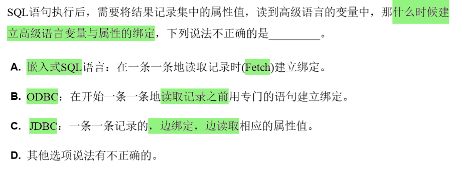

# 嵌入式 SQL

[TOC]

## 🔨 基础

🎯 **主要内容**

- **连接**：建立连接、打开链接、关闭连接；提交、撤销。
- **变量**：变量声明、引用。
- **单行处理。**
- **多行处理**：**游标**——声明游标、打开游标、读取记录、关闭游标。
- **错误捕获**：**sqlca** 及状态码识别。

**变量声明和使用**：

- 声明：在嵌入式 SQL 语句中出现的 **宿主语言所使用的的变量** 需要特殊声明：

  ```c
  exec sql begin declare section;
  	char vSname[10],specName[10]="mason";
  exec sql end declare section;
  ```

- 使用：使用 `exec sql select ... into 变量` 可以根据查询结果对变量赋值，在 SQL 语句中引用变量 **需要加上冒号** (在其他地方可以把该变量视为普通变量进行引用)：

  ```c
  exec sql select Sname, Sage into :vSname, :vSage 
      	from Student 
      	where Sname=:specName;
  ```

**连接**：

- 建立连接：`exec sql connect to 服务器名 as 连接名 user 用户名;` 或 `exec sql connect to default;`
- 断开连接：`exec sql disconnect 连接名;` 或 `exec sql disconnect current`。
- 提交和撤销：SQL 语句必须经提交或撤销才能确认操作结果。
  - 提交：`exec sql commit work;`
  - 撤销：`exec sql rollback work;`

**事务**：

- 概念：
  - 从程序员角度：**若干条 SQL 语句的一次执行** 被看作一个事务。
  - 从 DBMS 角度：通过事务 **将一系列操作作为一个整体** 进行控制，以便 DBMS 能够提供 **一致性状态转换**。
- 💎 特性：ACID
  - 原子性：一组操作作为一个整体不可分；
  - 一致性；
  - 隔离性：并发的各个事务之间互相不影响；
  - 持久性。

**游标**：前面的例子是单行处理，可直接将查询结果传送到变量；若检索多行结果，需要使用游标。数据要通过移动指针，一行一行地读取和处理(`fetch ... into`)。

```c
// 定义游标
exec sql declare cur_student cursor for
    select Sno,Sname,Sclass from Student where Sclass="0001";
// 打开游标
exec sql open cur_student;
// 获取数据
exec sql fetch cur_student into :vSno,:vSname,:vSclass;
... // 获取另一条数据
// 关闭游标
execc sql close cur_student;
```

**可滚动游标：** 普通游标只能 **单方向移动**——`fetch` 一次，移动一次，一条记录只能访问一次。但通过 ODBC 可以使用可滚动游标——游标可在记录集之间前后移动，一条记录可被多次访问。语法只是在原来的 `fetch 游标名` 之后加上 `PRIOR|NEXT|FIRST|LAST` 关键字——指定游标移动的方向。

⭐ **状态捕获 & 错误处理**：由三部分构成——

- 设置 SQL 通信区：**`exec sql include sqlca;`**

- 设置状态捕获语句：**`exec sql whenever 捕获条件 动作;`**

  - **捕获条件：**
    - `sqlerror`：检测是否有 **SQL 语句出错**。
    - `not found`：执行某个语句后，**没有结果**。
    - `sqlwarning`：警告。
  - **动作：**
    - `continue`：忽略条件，继续执行。
    - `goto 标号`：跳到标号处。
    - `stop`：终止程序、撤销当前工作、断开连接。
    - `do, call函数`：调用宿主程序的函数处理数据。

  - **whenever 的作用范围** 是其后所有 SQL 语句，直到 **程序中** 出现 **条件相同** 的 whenever 语句为止，且 **后面的覆盖前面的**。⚠ **whenever 的使用可能造成无限循环**。

- 状态处理语句。

---

📑 **习题**

1. `where current of 游标名` 的作用是允许更新或删除当前游标数据。
2. DBMS记录状态信息有三种方法： (1)sqlcode；(2)sqlca.sqlcode；(3)sqlstate
3. 通过游标操纵数据库
   - 使用 FOR UPDATE 子句表示既能通过游标更新表数据，也能删除表数据。
   - 在定义游标的查询语句时，必须加上FOR UPDATE子句。
   - 使用FOR UPDATE子句没有加OF表示通过游标可以修改表中的任何一列。 
4. 

---

## 🌊 动态 SQL

**概念**：SQL 语句可以在程序运行时 **动态构造**，形成一个 **字符串**，交给 DBMS 执行。

**两种执行方式**：

- **立即执行** `execute immediate`：通过宿主程序传递的 **字符串变量** 直接执行。

  ```c
  #include <stdio.h>
  exec sql include sqlca;
  // SQL 要用到的变量的定义
  exec sql begin declare section;
    char user_name[]="root", user_pwd[]="123456";
    char sqlString[]="delete from customers where cid=\'005\'";
  exec sql end declare section;
  
  int main() {
    exec sql whenever sqlerror goto report_error; // 状态捕获
    exec sql connect :user_name identified by :user_pwd;  // 连接
    exec sql execute immediate :sqlString; // 执行动态 SQL
    exec sql commit release; // 提交
    return 0;
    report_error: ...
  }
  ```

- **预编译执行**：先通过 `prepare` 语句将字符串变量进行 **预编译**，然后通过 `execute` 语句执行这个预编译后的语句，其中可以用 `using` 命令传入变量值。

  ```c
  #include "prompt.h"
  // 省略变量定义
  strcpy(sqlString, "Delete from customers where cid=:del_cid");
  exec sql prepare del_customer from :sqlString; // 预编译
  exec sql execute del_customer using :del_customer_id;
  ```

**数据字典**：又称为系统目录，是系统维护的 **表和视图** 的集合，其中部分信息可以通过 SQL 查到。

**SQLDA**：是 **SQL描述区**，记录着 **数据库/表等对象的定义信息**。（**SQLCA** 是 **SQL通讯区**，记录着 SQL 语句被 DBMS **执行后返回的状态信息**。）

**ODBC**：是不同语言的应用程序和不同数据库之间通讯的标准。

- 当 **应用程序** 调用 **ODBC API** 时，后者会调用 **DBMS Driver 库函数** 与数据库通讯，执行相应的动作并返回检索结果。
- 应用程序首先要分配一个 **SQL 环境(`SQLAllocEnv(&env)`)**，再产生一个数据库 **连接句柄(`SQLAllocConnect()`)**，然后才能 **打开连接(`SQLConnect`)**，通讯结束后要 **断开连接(`SQLDisconnect`)** 并 **释放环境(`SQLFreeConnect`, `SQLFreeEnv`)**。

**JDBC**：

- `java.sql` 核心 API ：
  - `java.sql.DriverManager`：处理驱动的调入，对新连接提供支持。
  - `java.sql.Driver`：通过驱动进行数据库访问。
  - `java.sql.Connection`：对特定数据库的连接。
  - `java.sql.Statement`：对特定的数据库执行SQL语句 。
  - `java.sql.PreparedStatement` 等。
- 使用过程：打开连接→创建 `statement` 对象，设置查询语句→执行查询，返回结果→处理错误的机制。

📑 **习题：**

1. 思维模式：**嵌入式 SQL** 使用 **游标** 执行 SQL， **ODBC** 使用 **句柄** 执行 SQL，而 **JDBC** 使用 **语句对象** 执行 SQL。
2. **动态构造** SQL 语句时不要忘了加上 **逻辑连接符**。
3. 