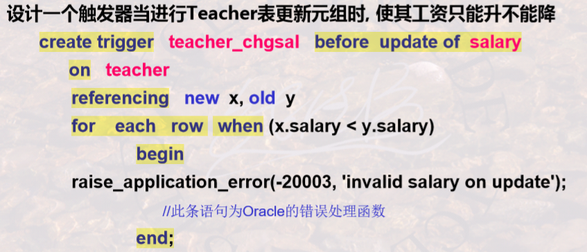

# 数据库完整性和安全性

[TOC]

🎯 **题型：**

1. **安全性控制**
2. **完整性约束**

---

## 🌕 数据库完整性

**完整性概念**：正确性、有效性、一致性。

完整性管理的作用：防止不合理数据的出现、语义不合理的现象。

**静态约束**：包括列约束、表约束。

- 列约束：是 **表约束的特例**，对 **单一列** 的值进行约束，包括：**NOT NULL、UNIQUE、PRIMARY KEY、CHECK (条件)** 等。

  ```sql
  create table Student (
      SId char(4) not null unique,
  	age integer check(age>=1 and age < 150)
      # 条件中只能使用该列(age)的值
  );
  ```

- 表约束：对关系的多列或元组进行约束，也包括 **UNIQUE、PRIMARY KEY、CHECK(条件)** 三个关键字，只是用法不同；另外还有一个 **FOREIGN KEY** 关键字。

  ```sql
  create table SC (
      CId char(8) not null unique,
  	# ...
      primary key(CId),
      foreign key(SId) references student(SId) 
      	on delete cascade
  );
  ```

  > [!Note]
  >
  > CHECK 中的条件可以是 Where 子句后的任何语句。

**动态约束**

<center></center>
<center></center>
---

## 🔐 数据库安全性

**DBMS 的安全性机制**：

- 自主安全性：存取控制，通过 **权限** 在用户之间传递。
- 强制安全性：对数据和用户 **强制分类**，不同类别用户能访问不同类别数据。

**自主安全性的实现方式**：存储矩阵 或 视图。

**各种操作的级别**：

- 级别一：Select
- 级别二：Insert、Update、Delete
- 级别三：Create、Alter、Drop

**授权操作**：

```sql
GRANT all PRIVILEGES|权限名
ON 表名|视图名
TO public|用户ID
```

注释：权限名包括：SELECT/UPDATE/INSERT/DELETE

**收回授权**：

```sql
REVOKE all PRIVILEGES|权限名
ON 表名|视图名
FROM public|用户ID
```

---

📑 **习题：**

1. 授权的数据对象的 **范围越小**，授权子系统 **越灵活**。
2. **Create Table** 的三种功能：
   - 定义关系模式
   - 定义完整性约束
   - 定义物理存储特性
3. 在已有表中建立一个约束的方法：
   - `alter table user add constraint 约束名 UNIQUE(列名)`
   - `alter table user add constraint 约束名 CHECK(条件)`
   - `alter table user add constraint 约束名 DEFAULT(默认值) for 列名`