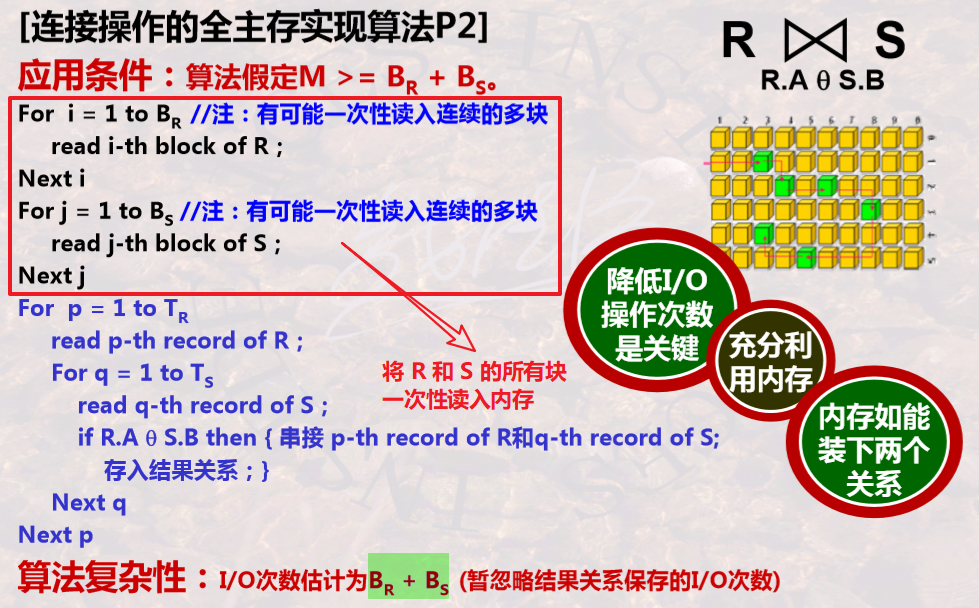

# 数据库查询实现算法

[TOC]

---

## 一趟扫描算法

🎯 **题型**

1. 表空间扫描法。
2. 四种扫描法的特点(复杂性+适用条件)。
3. 迭代器算法。
4. 各种操作的一趟扫描算法。

**连接操作的逻辑算法：**

T<sub>R</sub> 为关系 R 的元组数目。

```
For i = 1 to TR
	read i-th record of R;
	For j = 1 to TS
		read j-th record of S;
		if R.A θ S.B then
		{串接 i-th record of R 和 j-th record of S;
		 存入结果关系中;}
	Next j
Next i
```

**<mark>连接操作的物理算法之表空间扫描法</mark>**（四种方式）

磁盘以磁盘块为单位，**首先要把数据装进内存，然后才进行元组处理**。

所需参数：

- **TR**：关系 R 的 **元组数目**
- **BR**：关系 R 的 **磁盘块数目**
- **IR**：关系 R  **每个元组的字节数**
- **b**：每个磁盘块的字节数
- **M**：主存缓冲区页数

🔵 S 和 R 都一块一块读入内存（仅需 **3 块内存**,但 **I/O 次数** 最多：**BR + BR x BS**）

<center></center>
🔵 R 和 S 均一次性读入所有块（充分利用内存，降低 I/O 次数：**BR + BS**）

<center></center>
🔵 R 一次性读入所有块，S 一块一块读入（I/O 次数：**BR + BS**）

<center></center>
🔵 当 **BS>=M，BR>=M** 时，将 S 划分为若干个子集，**每个子集有 M-2 块**，一次读入 S 的这样一个子集合，R 还是一块一块读入。I/O 次数为 **BR(BS/(M-2))+ BS**。

**四种方法的比较：**


**<mark>迭代器算法</mark>**

🔵 **R∪S**：

```
Open() { R.Open(); CurRelatation := R; }
GetNext() {
	if(CurRelation==R) {
		t:=R.GetNext();
		if(t<>NotFound) return t;
		else { // R 读取结束，开始读 S
			S.Open(); CurRelation = S;
		}
	}
	return S.GetNext();
}
Close() { R.Close(); S.Close(); }
```

🔵 **R∩S**：

```
Open() { 
	R.Open(); S.Open();
	r := R.GetNext();
}
GetNext() {
	repeat {
		s:=S.GetNext();
		if(s==NotFound) {
			S.Close();
			r:=R.GetNext();
			if(r==NotFound) return NotFound;
			else { S.Open(); s:=S.GetNext(); }
		}
	} until (r与s能够连接);
	return r和s的连接;
}
Close() { R.Close(); S.Close(); }
```

🔵 **R-S**：

```
Open() {
	R.Open(); S.Open();
	r:=R.GetNext();
}
GetNext() {
	repeat {
		s:=S.GetNext();
		if(s==NotFound) { S.Close(); return r; }
		if(r==s) {
			r:=R.GetNext();
			S.Close(); S.Open(); s:=S.GetNext();
		}
	} until(r==NotFound)
}
Close() { ... }
```

---

📑 **习题**

1.  已知R和S的参数BR=BS=10,000，可用内存页数目为M。若要进行R和S的 θ-连接操作，没有索引可以使用，忽略结果存取的I/O次数。问：M应是怎样的 值，才能使磁盘的I/O次数不超过200,000。

   依据大关系算法复杂性“**<mark>BRBS /(M-2) + BS</mark>**”，如BRBS /(M-2) + BS<200,000，则可求出M应大于530。

2. 关于 **去重复&(R)操作** 的一趟扫描算法：

   - 非精确的讲，算法的应用前提是 **B(R) < =M**;
   -  算法可以做到 **只与一个内存块中的数据进行比较**，即可判断出是否有重复；
   - 算法可以 **边执行边建立内存数据结构**，即仅对已处理过的数据建立内存数据结构。

3. 关于 **分组聚集** 操作的一趟扫描算法：

   - 算法可以做到一条记录 **只与一个或少量几个内存块中的数据进行分组聚集计算**；
   - 需要 **首先对R的所有数据建立内存数据结构**，然后才能进行各个分组的聚集计 算。
   - 非精确的讲，算法的应用前提是B(R) < =M。

4. 在各种关系代数操作中，只有 **包上的并操作** 在任何时候都可以通过一趟扫描实现。

5. 假设关系R的 **元组个数为T(R)**，元组的大小为I(R)，存储块的大小为b，**B(R)=T(R)*I(R)/b**。 分析复杂性时，还要看关系是如何存储的，如果是 **聚簇关系(一个块中仅是该关系的元组)**，则其 **复杂性为 B(R)**，但如果是 **非聚簇系**，如果一个块中多个关系的元组混合存放，则可能一个元组在一个块中，则其 **复杂性为 T(R)**。

6. 已知关系 R 的参数如下：**聚簇存储磁盘块数 B(R)** = 1,000，**元组数 T(R)** = 20,000，R中 **属性 A 的不同值的个数记为 V(R, A)**=100。 R 上有基于属性 A 的 **排序索引**。关于σ<sub>A=0</sub>(R)，下列说法正确的是_______。

   A. 如果R是 **聚簇存储的且不使用索引**，则该操作的执行代价为1000个I/O
   B. 如果不使用索引，则该操作的执行代价为1000个I/O
   C. 如果R是 **聚簇存储的且使用索引**，则该操作的执行代价为1000个I/O
   D. 如果R是聚簇存储的且使用索引，则该操作的执行代价平均为100个I/O

   **解析：**选项 A 是正确的，**聚簇存储且不使用索引**，查询代价为 **B(R)**（聚簇存储磁盘块数）个 I/O。如果 R 是 **非聚簇存储的**，则其执行代价可能是 **I(R)**=20,000 个 I/O。如果 R 是 **聚簇存储的且使用索引**，则查询代价为  **B(R)/V(R,A)** 个 I/O。 

---

## 两趟扫描算法

🎯 **题型：**

1. 基于散列的两趟算法和基于排序的两趟算法。
2. 计算两趟排序时的磁盘读写次数。
3. 实现包操作/集合操作对应一趟还是两趟。

**两趟算法的思路：**

- 第一趟：划分子集，使子集有序或有相同散列值。
- 第二趟：进行多个子集间的归并排序/相同散列值子集的操作。

⭐ **基于排序 vs 基于散列的两趟算法：**

- **基于排序的两趟算法：**
  - 包上的并操作(**∪<sub>B</sub>**) 只需要一趟，因为不需要去重复。
  - 其他关系操作都需要两趟，需要去重复。

- **<mark>基于散列的两趟算法：</mark>**
  - 第一趟：散列子表——用一个散列函数将原始关系 **划分成 M-1 个子表并存储**。(将具有 **相同散列值** 的元组散列到 **相同子表**)
  - 第二趟：处理每个子表——用另一个散列函数 **将子表读入内存并建立内存结构**，进行不同操作的处理。(将具有相同散列值的 **散列子表散列到内存的某一块或几块**，在各个块中 **去重复**)
  - 第一趟是为了使子集具有相同散列值，**第二趟** 才是为了 **提高处理速度**。
- **<mark>基于散列的连接操作：</mark>**R (JOIN on R.A=S.B) S
  - 必须以 **相同的散列函数分别散列 R 和 S**，形成多个散列子表。
  - 散列过程中，**R 必须以 A 属性值作为散列函数的键值，S 必须以 B 属性值作为散列函数的键值。**
  - 第二趟处理中，要将 **R 的子表再完整地散列到内存** 的若干个块中，再 **一块一块地处理 S** 对应子表。

- **<mark>两种方法关于划分子表的比较：</mark>**
  - **基于排序** 的算法总是可以 **均匀地划分**(除最后一块，每个子表大小一样)
  - **基于散列** 的算法 **不能保证均匀划分**，因为它依赖于 **散列函数的选择 & 主文件数据的分布**。

- **<mark>两种算法思想的比较：</mark>**
  - 排序算法是先划分子表并 **独立处理子表**(第一趟)，然后再对各个子表进行关联性处理(第二趟)。
  - 散列算法是 **先从关联性角度处理** 形成子表(第一趟)，然后再独立处理每个子表(第二趟)。


📝 **计算磁盘读写次数** 例子：

🔵 已知内存共有8块，要排序有70块的数据集，计算下面这种归并方法的 I/O 次数：

1. 以 8 块为单位划分子集合，每个子集合进行内部排序并存储 => 形成 9 个子集合(包括一个 6 块的)；

2. 然后拿出 3 个子集合(其中包括 6 块的那个)进行三路归并 => 形成一个已排序子集合；

3. 将剩余的 6 个子集合，加上 (2) 中生成的子集合进行七路归并 => 形成最终有序集合。

**解析**：(划分子集合的原则是子集合块数 <= 可用内存块数)。在第一步中，因为要 **读取 70 块并存储这些块**，所以需要访问磁盘 **70x2=140** 次；第二步中，三路归并需要 **读取 8+8+6=22 块并存储这些块**，所以需要访问磁盘 **22x2=44** 次；第三部中，七路归并需要 **读取所有 70 块并存储这些块**，所以需要访问磁盘 140 次。=> 一共 140+44+140 次。

🔵 已知内存共有100块，若要排序有10000块的数据集，能否在两趟搞定，磁盘读写次数是多少？

**解析**：外部排序拢共两步：生成初始(有序)归并段 → 归并排序。

1. 因为共有 100 块内存块，所以 **初始归并段最大是 100 块**(即每 100 块划分为一个子集合)，那么会生成 10000/100=**100 个初始归并段**。  
2. 归并排序时，因为要 **留出一个块用来输出**，所以可以进行 **99 路归并**(还剩一块)=> 不能在两趟内就排好序。
3. 需要在 99 路归并之前加一个 2 路归并，将某两块合并成一块(变成99块)。
4. 生成初始归并段需要 **读取所有 10000 块，I/O 20000 次**； 2 路归并需要 **I/O 200x2=400 次**，最后 99 路归并需要 **读取所有 10000 块，所以需要 I/O 20000 次** => 共 40400 次。


