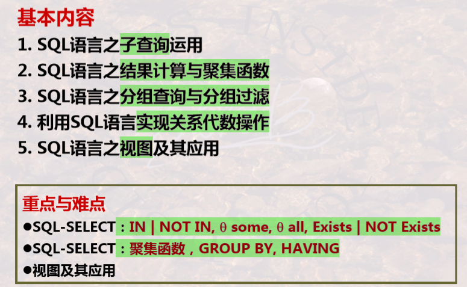
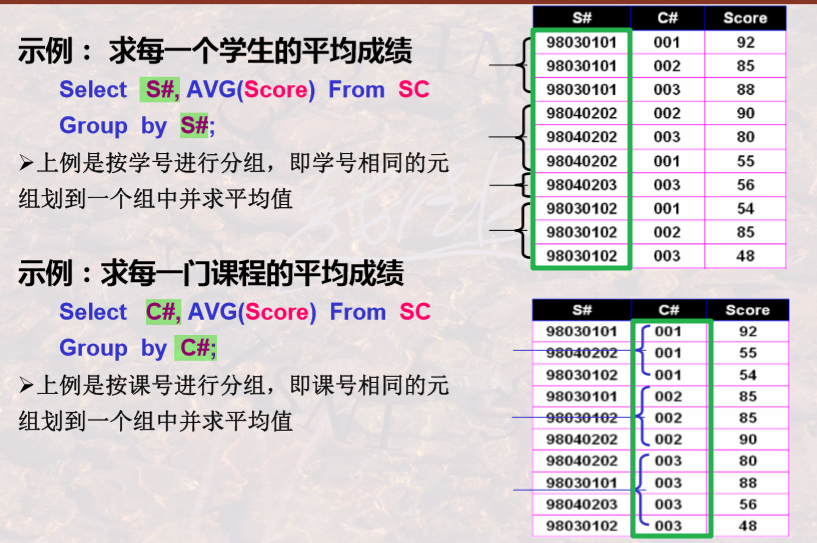
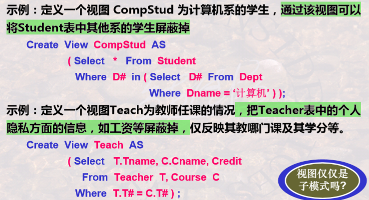

# SQL

[TOC]

## 🔍 SQL 概述

🎨 SQL 语言组成部分：

- __DDL__：(定义)Create、Alter、Drop。
- __DML__：(修改)Insert、Delete、Update、Select。
- __DCL__：(控制)Grant、Revoke。

🖐 **语法示例**：

- 📁 **创建数据库**：`create database 数据库名;`
- 📊 **创建表**：`create table 表名(列名 数据类型[Primary key|unique][Not null]);`
  + Primary key：每个表只能创建一个主键约束；
  + Unique：唯一性约束(候选键)，可以有多个唯一性约束。
- 📑 **插入元组**：`insert into 表名([列名,...]) values (值,...);`
  + distinct——结果去重
  + 插入查询结果——`insert into 表名(列名) select ...`
- 🔍 **查询**：`select [列名] from 表名 where ...;`
  + not、and、or
  + 模糊查询： `列名 [not] like "字符串"`，字符串可以使用通配符：
    * `%` 匹配任意个(包括0)字符；
    * `_` 匹配单个字符；
    * `\_, \%` 转义。
  + 指定范围：(not) in
- 📉 **结果排序**：`order by 列名 [asc|desc]`（用在 where 子句之后）
- ❎ **删除**：`delete from 表名 where ...`
- 📝 **更新**：`update 表名 set 列名 = 表达式|子查询 [where ...]`
- 🔨 **修正表定义**：`alter table 表名 操作`
  - 增加属性：`alter table student add address char(30)`
  - 修改已有属性的定义：`alter table student modify name char(10)`
  - 删除唯一性约束：`alter table student drop unique(name)`
- ✂ **丢弃**：delete 语句只是删除元组，而 drop 会丢掉所有相关信息，包括整个表和相关视图等。
  - 丢弃表：`drop table 表名`
  - 丢弃数据库：`drop database 数据库名`


🔗 __多表联合查询__

- __θ-连接__：·`select ... from 表1, 表2 where Student.S#=SC.S# and ...`
- __重名列的处理__：`select 列名 as 列别名`，`from 表名1 as 表别名1`

> [!Note]
>
> ```sql
> selct s1.S# 
> from sc as s1, sc as s2
> where ...
> ```

🔑 **SQL Server 数据库操作授权**

- 语法：`grant 权限名 on 表名 to 用户名`
- 权限名：select、update、delete、insert、exec、dri（声明引用完整性）。

📑 **习题**

1. `select` 对应关系代数的 **投影** 操作，`where` 对应 **选择** 操作，`from` 对应 **笛卡尔积**。

---

## 📚 复杂查询 & 视图

<center></center>
### 🎆 复杂查询

**some** & **all** ：**将表达式的值和子查询的结果比较**，区别是与子查询结果的 **某一个值相比满足条件**，还是与子查询结果的 **所有值相比都满足条件**。关键是要 **确定比较范围**。

- 找出工资最低的教师名：

  ```sql
  select name from Teacher
  where salary <= all(select salary from Teacher);
  ```

- 找出 001 号课成绩 **不是最高** 的所有学生的学号：

  ```sql
  select Sn from student
  where Cn = "001" and 
  	score < some(select score from SC where C#="001")
  # 比较范围只是 001 号课的成绩
  ```

> [!Note]
>
> 下面两种写法等价：
>
> - `表达式 in (子查询)`
> - `表达式 = some(子查询)`

**not exist(子查询)**：表示不存在子查询中的情况。**将原本的意图变成双重否定**，即可使用 not exist。例如在下面这个例子中，原要求可以转化为：**结果集合中不包含...的元组**。

<center></center>
<center></center>
注意：嵌套查询中有类似 **作用域** 的概念，出现过的表可以在子查询中使用，而不必再写出。

---

### 💻 结果计算与分组

**结果计算**：select 后面不仅可以是列名，还可以是 **计算表达式** 或 **聚集函数**，在投影的同时进行一些运算。例如：

```sql
select name 2020-Student.age as birthYear from Student
# 将 2020-Student.age 的计算结果作为检索结果的一个属性
```

**聚集函数**：COUNT、SUM、AVG、MAX、MIN.

> [!Warning]
>
> **聚集函数不能用于 where 子句**，因为 where 子句用于 **对元组进行条件过滤**，**而不是对集合** 进行条件过滤。

**结果分组**：在 **多个元组中有相同的某个属性值** 时，可以据此属性对结果分组。

<center></center>
**过滤分组**：where 子句中只能过滤元组，而过滤分组需要使用 having 子句，它用在 group by 子句之后。

例子：求超过两门不及格的学生学号：

```sql
select S# from SC
where score < 60
group by S# having count(*) > 2;
```

🔔 **注意语义问题：**

<center></center>
**实现关系代数**：**并 UNION、交 INTERSECT、差 EXCEPT。** 它们的语法都一样，都是连接两个查询。以并操作为例。求学过 002 号课程或者 003 号课程的学生学号：

```sql
select S# from SC where C# = "002"
UNION
select S# from SC where C# = "003";
```

**空值处理**：使用 `is [not] null` 来检测是否为空值。空值处理需要注意几点：

- 除了 `is [not] null` 之外，空值 **不满足任何查找条件**。
- 若 `null` 参与 **算术运算**，则算术运算的值为 `null`。
- 若 `null` 参与 **比较运算**，则结果可视为 `false`。
- 在 **聚集运算** 中，除 `COUNT(*)` 之外，都会将 `null` 忽视。

**内连接、外连接**：**INNER JOIN、LEFT | RIGHT | FULL OUTER JOIN**。语法为(以内连接为例)：

```sql
select 列名 
from 表名1 [natural] inner join 表名2
	 ON 连接条件
where 条件
```

注意：`natural` 表示自然连接，会 **将公共属性合并**。

---

### 🎥 视图

**概念**：在 SQL 中，**基本表** 对应 **概念模式** 的数据，**视图** 对应 **外模式** 的数据。而且 **视图包含外模式和 E-C映像。**

- 基本表是存储在文件中的表，其中的数据是需要 **实际存储** 的；
- 视图只存储 **由基本表导出视图需要的公式**，其数据不需要存储。
- 对视图数据的更改最终要反映到对基本表的更改上。

**视图定义**：定义视图是为了 **屏蔽无关的或者不希望被相关程序访问的数据**。

```sql
create view viewName [(列名)]
		as 子查询
```

注意：如果不指定视图中的列名，会默认使用子查询结果中的列名。

<center></center>
**使用视图**：视图可以向普通的表一样，在各种语句中使用。

**视图更新**：视图不保存数据，对视图的更新要反映到基本表上，所以视图更新比较复杂。

✅ 可以更新：视图是 **从单一表中通过选择投影操作生成** 的，且 **包含主键**，则可以更新。

❎ 不可更新的情况：

- 定义视图的 select 目标列包含 **聚集函数**；
- 定义视图的 select 子句使用了 **unique** 或 **distinct**；
- 定义视图时使用 **group by**；
- 视图中包含算术表达式 **计算出来的列**；
- 视图虽然由单个表的子集构成，但是 **没有主键**。

**视图删除：** **drop view 视图名**。

---

📑 **习题：**

1. 使用多个表查询时要有 **连接条件**。
2. 视图是一种**子模式(外模式)**及子模式到**模式(概念模式)**的映像。
3. **内连接** 对应于关系代数中的θ-连接，结果是 **两个表中符合条件的元组的集合**。
4. **union** 连接的两个子查询中，相同的列要以相同的顺序出现。
5. **group by** 可以在子查询中使用。
6. 与 **not in** 等价的操作符是 **<>all**.
7. 注意 **group by ... having ...** 修饰的对象。
8. **having count(*)** 表示该 group 中元组个数。
9. 假设一个元组在子查询 1 中出现 m 次，在子查询 2 中出现 n 次，其中 m>0,n>0, 则：
   - **UNION、INTERSECT 是集合操作**，相同元组只能出现 **一次**。
   - **EXCEPT** 是集合操作，相同元组出现 **0 次**。
   - **UNION ALL** 是包的操作，相同元组出现 **m+n** 次。
   - **EXCEPT ALL** 也是包的操作，出现 **max(0, m-n)** 次。
10. ✅ 视图删除后，由该视图导出的其他视图也将删除。❎ 试图修改后，基本表也将修改。
11. 、有一个学生表 student，包含主键 S#（学生编号）等。又有分数表 SC，包含 S#（学 生编号）、score（分数）等。已知 student 表中共有 50 个学生，有 45 人参加了考试（分数 存在 SC 表中），其中 10 人不及格。执行以下 SQL 语句：`select * from student where **exists** (select S# from SC where score<60 )`， 可返回_________条记录。🧭 解析： 因为这是 **非相关子查询**，而且 **子查询始终为真**（因为已 知有 10 人不及格），故检索出的是 Student 表中的所有记录。