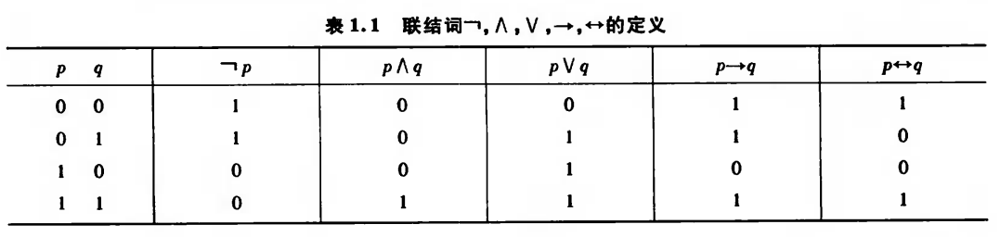

# 命题逻辑

[TOC]

---
## 基本概念

__命题：__

- 非真即假的陈述句称为 __命题__。
- 命题的判断结果称为 **真值**，真值为真的命题称为 **真命题**，否则称为 **假命题**。
- 不能被分解成更简单命题的命题，称为 __简单命题/原子命题__。
- 由简单命题通过 __联结词__ 联结而成的命题，称为 __复合命题__。

> [!Tip]
> 判断给定句子是否为命题，首先判断是否为 __陈述句__，其次判断是否有 __唯一的真值__。
> 我们 __是否知道__ 它的真值不重要，只要它有唯一真值即可。

__联结词：__

1. __否定式__：__﹁p__。
2. __合取式__：__p∧q__。
3. __析取式__：__p∨q__。
4. __蕴含式__：__p→q__，p叫做前件，q叫做后件。逻辑关系是 __p 是 q 的必要条件。__
  - p 为真，q 为真，则 p→q 为真；
  - p 为假，不管 q 是真是假，p→q 都为真。
  - p 与 q 可以无任何内在联系。
5. __等价式__：__p↔q__，p 当且仅当 q，互为充要条件。

**小结：**

---

**命题公式**

- **公式**：将 **命题变项** 用 **联结词和圆括号** 按一定的逻辑关系连接起来的符号串称为 **合式公式**，简称为公式。
- **赋值**：给公式 A 中所有命题变项都指定一个值，称为对 A 的一个赋值或解释。若这些值使 A 为真，则这组值叫做 A 的 **成真赋值**，否则叫做 **成假赋值**。
- **真值表**：将命题公式 A **在所有赋值下取值情况** 列成表，叫做 A 的真值表。
  - 若 A 在各种赋值下均为真，称 A 为 **重言式/永真式**；
  - 若 A 在各种赋值下均为假，称 A 为 **矛盾式/永假式**；
  - 若 A 不是矛盾式，则 A 是 **可满足式**。

---
## 等值演算

**等值式**：

- **等值式**：若 A↔B 为重言式，则称 A 和 B 是等值的，记作 $$A \Leftrightarrow B$$。(A↔B永远为真)
- **等值演算**：由已知的等值式推算出其他等值式的过程叫做等值演算。
- **公式：**
  - 分配律：$$A \vee (B \wedge C) \Leftrightarrow (A \vee B)\wedge(A \vee C)$$
  - 德摩根律：﹁(A∨B)$$\Leftrightarrow$$﹁A∧﹁B。
  - 蕴含等值式：A→B$$\Leftrightarrow$$﹁A∨B。

**析取范式 & 合取范式：**

- **简单析取式/合取式**：由有限个 **文字** 组成的析取式/合取式叫做简单析取式/合取式。例如 p∨﹁q 是由 **2 个文字** 组成的简单析取式。
    > [!Note]
    > 一个文字既是简单析取式，也是简单合取式。

  - 定理：判断简单析取式是重言式，简单合取式是矛盾式的定理：
    - 一个 **简单析取式是重言式** $$\Leftrightarrow$$ **同时含某个命题变项和它的否定式**；
    - 一个 **简单合取式是矛盾式** $$\Leftrightarrow$$ **同时含某个命题变项和它的否定式**。

- **析取范式/合取范式：**
  - 定义：
    - **析取范式**：$$A_1 \vee A_2 \vee \cdots \vee A_n$$，其中 $$A_i$$ 是 **简单合取式**。
    - **合取范式**：$$A_1 \wedge A_2 \wedge \cdots \wedge A_n$$，其中 $$A_i$$ 是 **简单析取式**。
  - 定理：
    - 一个析取范式是矛盾式 $$\Leftrightarrow$$ 每个简单合取式都是矛盾式。
    - 一个合取范式是重言式 $$\Leftrightarrow$$ 每个简单析取式都是重言式。

**联结词的完备集**

- n 元真值函数：n 个命题变项共可构成 $$2^{2^n}$$ 个不同的真值函数
- **联结词完备集**：S 是一个联结词集合，如果 **n 元真值函数** 都可以由 **仅含 S 中的联结词构成的公式** 表示，则称 S 是联结词完备集。
  - 定理：S = {﹁,∧,∨} 是联结词完备集。
  - 推论：以下都是联结词完备集：
    - {﹁,∧,∨,→}
    - {﹁,∧,∨,→,↔}
    - {﹁,∧}
    - {﹁,∨}
    - {﹁,→}

  - 与非式：p ↑ q $$\Leftrightarrow$$ ﹁(p∧q)  
  - 或非式：p ↓ q $$\Leftrightarrow$$ ﹁(p∨q)
    - {↑} 是联结词完备集；
    - {↓} 是联结词完备集。 

---
## 推理理论

**推理的形式结构**

- 定义：除非 **前提** $$A_1 \wedge A_2 \wedge \cdots \wedge A_k$$ **为真**，但是 **结论 B 为假**，推理都是**正确的/有效的**。
- 记法：由 $$\Gamma$$ 推 B 的推理记为 $$\Gamma \vdash B$$。推理正确则记为 $$\Gamma \models B$$。
- 判断推理是否正确：在真值表中如果出现 **前提为 1，结论为 0** 的情况，则推理错误，否则正确。