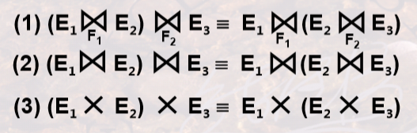
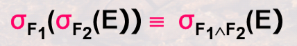
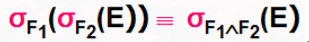

# 查询优化

🎯 **<mark>题型</mark>**

1. 逻辑查询优化和物理查询优化的概念。

2. 常用优化查询策略。

3. **关系表达式的等价变换**。

4. **以语法树形式给出优化结果。**

5. **代价估计**。

**逻辑查询优化 vs 物理查询优化：**

- 逻辑：关系代数操作次序的优化。
- 物理：关系代数操作实现算法的优化。

**定理：**

1. 交换律(连接、积)：通常选择结果集合小的表达式先装入内存。

   

2. 结合律(连接、积)：通常选择结果集合小的表达式先计算。
   
   

3. 投影串接律：设属性集 **{A1,...,An} 含于 {B1,...,Bm}**，则有：
   
   

4. 选择串接律：

   

5. 选择和投影交换：设条件 F 只涉及属性 {A1,...,An}，则有：

   

6. σ 和 ∪ 的交换：E1、E2 是并相容的。

   

7. σ 和 ∪ 的交换：E1、E2 并相容。

   

8. σ 和 - 的交换：

   

9. π 和 ∪ 的交换：

   

> [!Danger]
>
> 投影和差没有交换律。

**语法树：**

- 一个运算符应该只有 **两个操作数**。
- 树根在上，树叶在下。

⭐ **<mark>选出优化后的语法树：</mark>**

- 排除 **初始的未优化** 的树。(首先排除)
- 是否可以将 **投影操作下放到更靠近叶子结点**。（分支中要有投影操作）
- **乘积** 操作和其后的 **选择** 操作应该 **合并成连接操作**。（找连接符号(蝴蝶结)）

**查询优化策略：**

- **尽可能早地做选择 & 投影操作**，可有效减少中间结果的元组数目。
- 将 **笛卡尔积** 和其后的 **选择操作** 组合成 **连接操作**，可有效减少中间结果元组数目。

⭐ **<mark>代价估计</mark>**：

设关于关系 R 中的各个参数为：

- T(R)：R 中元组数目；
- B(R)：R 的磁盘块数目；
- I(R)：每个元组的字节数；
- **V(R,A)**：R 中 **属性 A 出现不同值的数目**。

🔵 **<mark>不等值条件</mark>**： **S = σA<c(R)**：估计 **概率为<mark> 1/3 </mark>**，则代价为 T(R)/3。

🔵 **<mark>等值条件</mark>**：**S = σA=c(R)**：估计 **概率为<mark> 1/V(R,A) </mark>**，则代价为 T(R) / V(R,A)。

🔵 **<mark>or 运算</mark>：** **S = σC1 or C2(R)**：估计概率 **<mark> (1- (1-C1概率) x (1-C2概率)) </mark>**，代价为 T(R) x [1- (1-C1) x (1-C2)]。

🔵 **<mark>and 运算</mark>：** **S = σA=10 AND B<20(R)** ：等值条件的概率和不等值条件的概率 **相乘**：**估计概率为<mark> (1/V(R,A)) x (1/3) </mark>**，代价为 T(R)/(3xV(R,A))。

🔵 **<mark>连接操作</mark>**：**R (Join on R.Y=S.Y) S **：估计概率为 **1/max[ V(R,Y), V(S,Y) ]**，代价需要乘以连接操作结果集的元组数 T(R)xT(S)。

📑 **习题：**

1. 对于变换 ：
   - **左侧 → 右侧**，是为了减少扫描次数；(在 **逻辑优化结束前** 进行)
   - **右侧 → 左侧**，是为了将复杂的操作变为简单操作。(在 **逻辑优化起始** 进行，便于下移)

