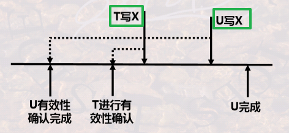
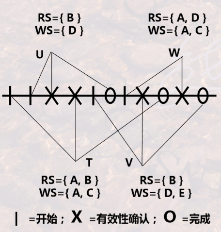

# 事务处理

[TOC]

---

## 🚦 并发控制

🎯 **题型：**

1. 并发控制的方法。
2. 调度类型。
3. **调度中容易出现的问题。**
4. 事务冲突。
5. 有效性确认。
6. 加锁解锁机制。

**并发控制概念**：并发控制就是通过 **正确安排事务微观交错执行次序** 来保证事务宏观的独立性、完整性和正确性。

**🚦 事务调度：** **一组事务的基本操作**(读、写、加锁、解锁等)**的一种执行顺序** 称为对这组事务的一个调度。

- 并发调度的正确性：当且仅当 **在这个并发调度下所得到的的结果**，与 **分别串行地运行这些事务所得到的的结果** 完全一致， 就可以说调度是正确的。

- **可串行性**：无论数据库初态如何，**该调度对数据库的影响都和某个串行调度相同**，则说该调度可串行化。

  - **可串行化调度一定是正确的并行调度，**但反过来则未必。
  - **并行调度** 的正确性是指 **内容上结果的正确性**，而 **可串行化** 是指 **形式上结果的正确性**。

  

- **冲突** 是指 **一对连续的动作**，满足条件：如果它俩 **顺序交换**，那么涉及到的 **两个事务至少有一个的行为会改变**。冲突的几种情况如下：

  - **同一事务的任何两个操作** 都冲突。
  - **不同事物对同一元素的两个写操作** 冲突。（写-写）
  - **不同事物对同一元素的一读一写操作** 冲突。（读-写，写-读）

- **冲突可串行性**：一个调度，若能通过 **交换相邻两个无冲突的操作** 能够 **转换为串行的调度**，则称该调度为冲突可串行性调度。

  - **满足冲突可串行性，则一定满足可串行性。反之不然。**

  - **冲突可串行性判别**：构造一个有向图，结点是 **各个事务Ti**，根据下面的要求绘制边：如果 Ti 的一个操作与 Tj 的一个操作 **冲突（两个写操作/一读一写操作）**，**且 Ti 先于 Tj**，则 **绘制一条有向边，从 Ti 指向 Tj**。最后如果图中没有环，则说明是冲突可串行化的。

    

🔐 **基于封锁的并发控制方法：**

- 锁：

  - 每个元素都有唯一的锁；
  - 每个事务读写数据前，要获得锁；
  - 如果被其他事务持有该元素的锁，则要等待；
  - 事务处理完成后要释放锁。

- **<mark>锁的类型</mark>**：

  - 排他锁 X：只有一个事务能读写，如果一个事务对数据已经加上排他锁，则 **不允许** 任何事务再对其加 **任何锁**。
  - 共享锁 S：所有事务都能读，但都不能写。一个事务对数据已经加上共享锁 S 锁，则 **允许** 其他事务再对其加 **共享锁**，但 **不允许** 任何事务对其加 **排他锁**。

- <mark>**两段封锁协议：**</mark>读写数据之前要获得锁，每个事务中所有 **封锁请求要先于任何一个解锁请求**。所谓两段就是加锁段和解锁段——加锁段中不能有解锁操作，解锁段中不能有加锁操作。

  - **可以保证冲突可串行性**；(保证数据更新的一致性)
  - **可能产生死锁。**

  

  

🕒 **基于时间戳的并发控制方法：**

- 时间戳：可以表征事务执行的先后次序，时间戳小的事务先执行。

- 思想：**为每一个数据库元素保存读时间戳和写时间戳**，以记录读写该元素的最后事务。通过在 **事务读写数据时判断是否存在冲突**(读写、写读、写写)来强制事务以 **可串行化** 的方式执行。

- 执行时判断冲突，如果冲突(读-写、写-读、写-写)，则 **重启该事务**，这样就获得了一个更大的时间戳。比较时间戳的方法；

  - 若为 **写操作**，将 **当前事务的时间戳** 与 **最后读该元素或写该元素的事务的时间戳** 比较，大于则执行，否则重启；
  - 若为 **读操作**，将 **当前事务的时间戳** 与 **最后写该元素的事务的时间戳** 比较，大于则执行，否则重启。

  

🕵️‍♂️ **基于有效性确认的并发控制方法：**

- 思想：它也在事务启动时刻为事务赋予唯一的时间戳，但和基于时间戳的方法不同的是，它 **为每一个活跃事务保存其读写数据的集合**，对多个事务的 **读写集合来判断是否有冲突**，叫做有效性确认，据此来完成事务的提交或回滚，强制事务以可串行化的方式执行。

- <mark>规则：</mark>

  - **较早的事务 U 正在写入 T 读过的某些对象**，则 T 暂不能进行有效性确认。

    

  - 如果 **T 进行有效性确认后，要比一个较早的事务 U 先写某个对象**，则 T 暂不能进行有效性确认。

    

- 另一种有效性确认的规则：当前事务 **开始于某个事物 X 之前**，则需检查 **读集合与 X 的写集合的交集** 是否为空；当前事务的 **有效性确认开始于某个事物 Y 之前**，则需检查 **写集合与 Y 的写集合的交集** 是否为空。

   

  - U 的有效性确认：**没有任何事务早于 U 进行有效性确认**，所以 U 可以直接进行确认。
  - T 的有效性确认：
    - **T 开始于 U 完成之前**，要看 **T 的读集合 ∩ U 的写集合** 是否为空，为空才能确认；
    - 而且 **T 的有效性确认在 U 结束之前**，要看 **T 的写集合 ∩ U的写集合** 是否为空，为空能才确认。
  - V 的有效性确认：
    - **V 开始于  U 完成之前**，要看 **V 的读集合 ∩ U 的写集合** 是否为空，为空才能确认；
    - 而且 **V 开始于 T 完成之前**，要看 **V 的读集合 ∩ T 的写集合** 是否为空，为空才能确认；
    - 而且 **V 的有效性确认在 T 完成之前**，要看 **V 的写集合 ∩ T 的写集合** 是否为空。

⭐**<mark>并发访问中的各种问题：</mark>**

- **脏读**：事务 A 读取了事务 B 中 **修改过但是尚未提交** 的数据，然后 B **回滚** 了，这样 A 中的数据就是错误的。

- **重复读**：一个事务 **多次读取同一个数据，但是返回不同的值**，因为在两次读取的间隔，该数据被另一个事务修改并提交了。

- **丢失修改**：事务 A 和 B 读入同一数据并修改，但是 **B 提交的结果导致 A 提交的结果失效** 了。

  

📑 **习题**

1. 两段封锁协议的要求：
   - 读取数据前需要加锁。
   - 解锁之后不能读写数据。
   - 某一事务在对 **某个对象** 解锁之后不能再对 **任何对象** 加锁。
2. 判断是否有冲突：
   - **先执行的事务先读/写，后执行的事务后读/写 => 无冲突；**
   - 先执行的事务后写，后执行的事务先读 => **过晚的写**，有冲突；
   - 先执行的事务后读，后执行的事务先写 => **过晚的读**，有冲突。
3. **非冲突可串行化** 意思是没有冲突，且可串行化。
4. 加锁：
   - 当某一事务对某对象持有 S 锁时，其他事务可以给该对象再加 S 锁 和 U 锁，但不能加 X 锁；
   - 当某一事务对某对象持有 U 锁时，其他事物不能给该对象再加任何类型的锁。
   - 当事务有写操作时，需要加 X 锁，但只有在该事务 **提交时刻解锁，才能保证事务执行是可恢复的**。
5. 基于时间戳的控制方法：在每一步操作的同时更新该元素的时间戳，如果该时间戳大于该元素原来的时间戳，则回滚。

---

## 🚒 故障恢复

🎯 **题型**

1. **DBMS 管理缓冲区的四种策略。**
2. **Undo 型日志和 Redo 型日志。**
3. 介质故障的恢复。
4. 检查点的概念。

**故障恢复类型：**

- **事务故障** 恢复：
  - **重做事务**(Redo)：保证已提交事务的 **持久性**。
  - **撤销事务**(Undo)：消除未提交事务的影响。
- **系统故障** 恢复：
  - 运行日志：是 DBMS 维护的一个文件，以流水方式记录了每一个事物对数据库的 **每一次操作和操作顺序**，直接写入 **介质存储**。事务操作数据库时，会 **首先写运行日志，写成功后，再与数据库缓冲区进行信息交换。**
  - 按照日志记录的 **事务操作顺序** 可以 **重做事务** 或者 **撤销事务** ，从而恢复系统故障。
    - 故障时已提交 => **Redo**。
    - 故障时未提交 => **Undo**。
  - **<mark>检查点</mark>**：DBMS 在运行日志中定期设置和更新检查点——在该时刻，强制将 **数据库缓冲** 中的内容 **写回** 数据库。
    - 在检查点之前内存中数据与介质中数据是一致的。
    - 在检查点之后结束或发生的事务需要依据运行日志进行恢复。
- **介质故障** 恢复：备份。

⭐**<mark>四种缓冲区处理策略：</mark>**

- **Force**：缓冲数据 **最晚在 commit 时** 写入磁盘。（要求较严）

- **No Force**：允许在 **commit 之后** 再写入磁盘，可能系统崩溃时还未写入，需要 **Redo**。

- **Steal**：允许在 **commit 之前** 写入，若系统在 commit 之前崩溃，可能已经有写入，恢复需要 **Undo**。

- **No Steal**：不允许在 commit 之前写入。（要求较严）

  

  Force 和 No Steal 策略要求较为严格，所以读写性能较慢，但无需恢复。

⭐ **<mark>Undo 型日志 & Redo 型日志</mark>**

- **Undo 型日志：**
  - 特点：
    - **仅保留旧值；**
    - **先输出后写提交记录。**
    - 把改变的数据 **全部写入磁盘之前不能 commit** 该事务。
  - 故障恢复：**从日志的尾部开始**，按日志记录的 **反序** 处理每一记录，**撤销未完成事务的所有修改。**
- **Redo 型日志：**
  - 特点：
    - **保留新值。**
    - **先写提交记录后输出。**
  - 故障恢复：**从起始位置开始**，按日志记录的 **正序** 处理每一记录，**重做已提交事务。**
- **Undo/Redo 结合型日志：**
  - 特点：
    - **既保留新值，也保留旧值。**
    - **输出和提交无所谓先后**，只要保证 **写入 <T,X,v> 这一步在输出之前** 即可。
  - 故障恢复：
    - **按正序重做已提交的事务**；
    - **按反序撤销未提交事务的所有修改**。